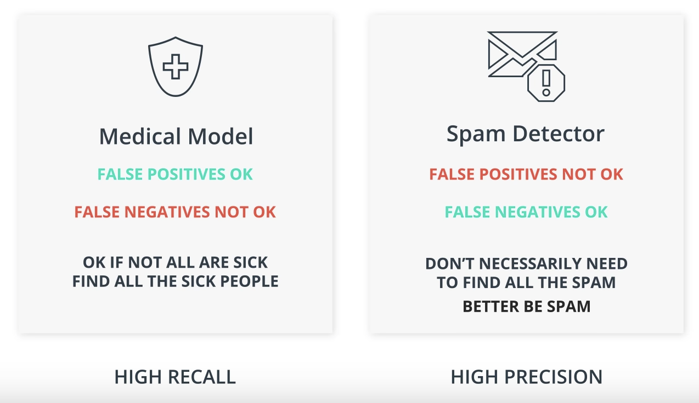
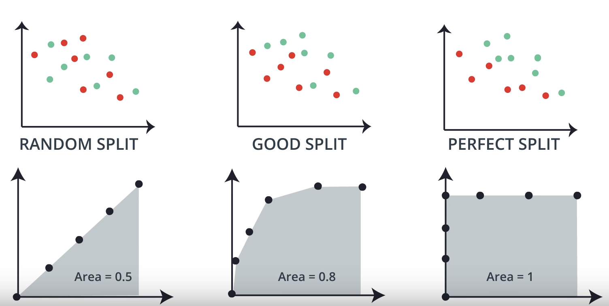

# Model evaluation and validation

## Evaluation Metrics

### Confusion Matrix
A confusion matrix is a table that is often used to describe the performance of a classification model.

The confusion matrix for a binary classifier looks as follows:

 
**Note:**  
_False Positive_ is also known as _Type 1 Error (Error of the first kind)_. 
_False Negative_ is also known as _Type 2 Error (Error of the second kind)_.

### Accuracy
The accuracy of a model tells of how many points get classified correctly.

\\(\text{Accuracy} = \frac{\text{Correctly classified points}}{\text{All points}}\\)

However, the accuracy isn't always a suitable metric to say whether a model performs well or not. 
This is typically the case when data are imbalanced. For example, let's assume we want to predict whether an e-mail is spam or not. Such a dataset will often comprise of many non-fake e-mails and a few fake e-mails. A highly imbalanced dataset. 
What would be a potential model that achieves a good accuracy? Well, let's assume we have a model that classifies every e-mail as non-spam. Since the minority of the e-mails is non-spam your classifier will achieve a very good accuracy. Nonetheless, despite a good accuracy, our model is insufficient since it's not able to classify an e-mail as spam.  
Therefore, evaluating the accuracy of this model is pointless.

### Precision and Recall
If we work with imbalanced data _Precision_ and _Recall_ is a useful metric to measure the model performance.

**Out of the points we have predicted to be positive, how many are correct?**    
\\(\text{Precision} = \frac{\text{True Positives}}{\text{True Positives + False Positives}}\\)   

**Out of the points labelled positive, how many did we correctly predict?**    
\\(\text{Recall} = \frac{\text{True Positives}}{\text{True Positives + False Negatives}}\\)    

The significance of a metric does always depend on the problem set. For example: 

### F1-Score
Carrying around two numbers (Precision and Recall) is inconvenient. Ideally, we can have one number that combines these two scores. Such a metric is called the F1-Score.

\\(\text{F1-Score} = \text{2} \cdot \frac{\text{Precision} \cdot \text{Recall}}{\text{Precision} + \text{Recall}}\\)   

You might wonder why we cannot simply take the average of both values. Unfortunately, the average has an undesirable property. Let's consider the extreme cases where Precision / Recall is either 100% or 0%. Computing the average would yield a score of approx. 50% despite the fact that the performance is worse.
The F1-Score instead is based on the Harmonic Mean which allows us to overcome this problem.

### F-beta Score
Depending on whether Precision or Recall is more important for our model we can use a generalized version of the F1-Score also denoted as F-beta Score.

\\(\text{F}_{\beta} = (\text{1+N}^{2}) \cdot \frac{\text{Precision} \cdot \text{Recall}}{\text{N}^2 \cdot  \text{Precision} + \text{Recall}}\\)   

**Example - What score should be used for which problem?**

* **F2-Score:** Detecting malfunctioning parts in a spaceship
* **F1-Score:** Sending phone notifications about videos a user may like
* **F0.5-Score:** Sending promotional material in the mail to potential clients

### ROC Score
A receiver operating characteristic curve is a graphical plot that illustrates the diagnostic ability of a binary classifier system as its discrimination threshold is varied.

The ROC curve is created by plotting the true positive rate (TPR) against the false positive rate (FPR) at various threshold settings. 

\\(\text{TPR} = \frac{\text{True Positives}}{\text{All Positives}}\\)   
\\(\text{FPR} = \frac{\text{False Positives}}{\text{All Negatives}}\\)   

## Model Selection

### Types of Errors
**Overfitting:** Overcomplicate the problem. The model does well in the training set but tends to memorize it instead of learning the characteristics of it. Error due to variance.

**Underfitting:** Oversimplify the problem. Does not do well in the training set. Error due to
bias.

### Cross Validation
**Golden Rule:  Never use testing data for training**

A solution to this problem is splitting the data into a training set, cross validation set and testing set.

**Training set:** Used for training the parameters
**Validation set:** Used for making decisions about the model (e.g. degree of the polynomial)
**Testing set:** Measure the performance of the model

**Example:**
Train models of different degrees (1,2,3,4). Then we use the cross validation set to calculate the score (e.g. F1-Score) for each model. Finally, we pick the model with the highest score and use the test set to compute the accuracy.

### k-Fold Cross Validation
The Cross Validation approach has a significant drawback. Since we spit our data, we always throw away some data. k-Fold Cross Validation is a useful method to recycle our data.

We break our data into k buckets. Every time we use one bucket for testing and k-1 buckets for training. Finally, we average the result.

### Learning Curves
The following graph shows how we can differentiate between overfitting, underfitting and a "good" model.

### Grid Search
Grid Search is a simple way to find the best parameter for different models. Literally, what it does is it makes a table with all possibilities and picks the best one.

