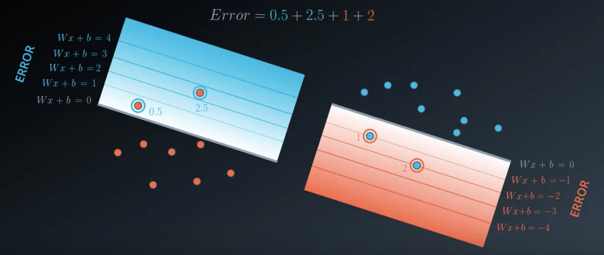
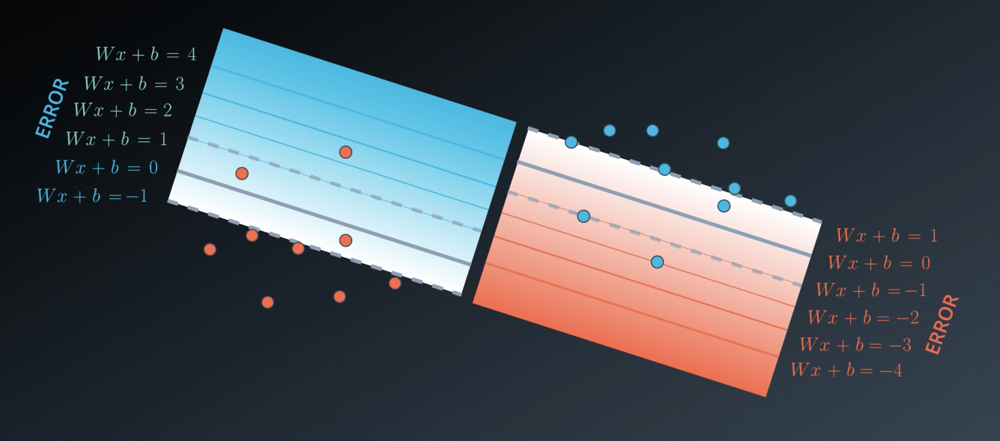
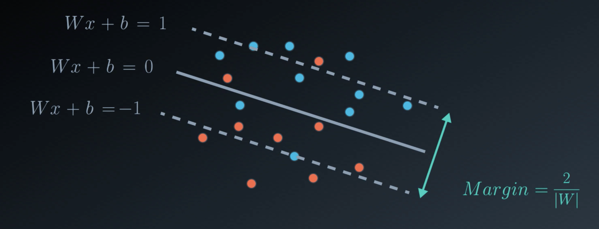
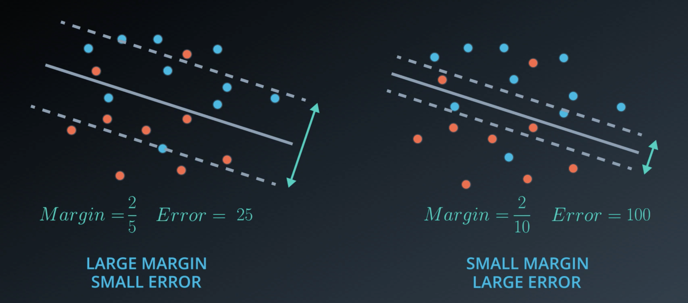
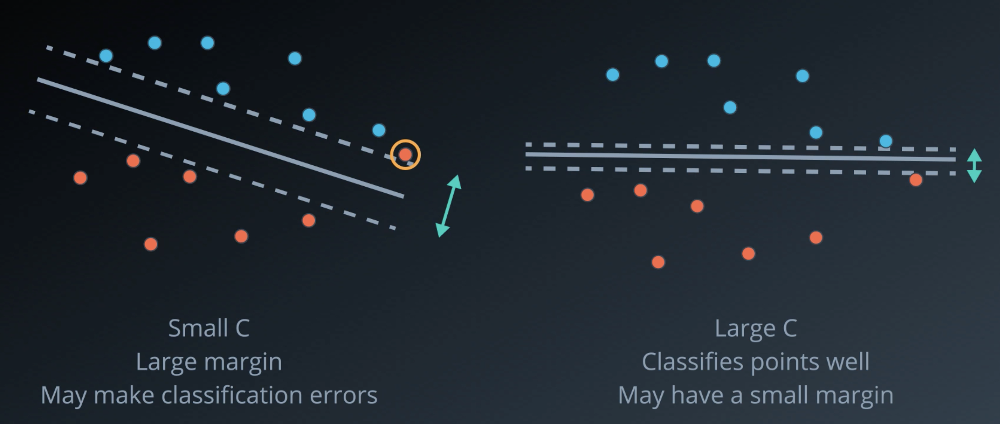

# Supervised learning

## Linear Regression

### Absolute Trick

If the point is above the line:  
$y = (w_{1}+\alpha \cdot p) \cdot x + (d+\alpha)$

If the point is bellow the line:  
$y = (w_{1}-\alpha \cdot p) \cdot x + (d-\alpha)$

**Why do we need the p?**

* If p is on the left of the y-axis, it's a negative number. Therefore we rotate the line in the correct direction.
* If the distance to the y-axis is small, we want to add a small number. Otherwise, we are going to add a large number.

### Squared Trick
Idea: If the point is close to the line, we want to move the line more than when it's close.

$(y = (w_{1}+p(q-q')\alpha) \cdot x + (d+(q-q')\alpha)$

### Linear Regression Warnings

**Linear Regression Works Best When the Data is Linear**

Linear regression produces a straight line model from the training data. If the relationship in the training data is not really linear, you'll need to either make adjustments (transform your training data), add features or use another kind of model.

**Linear Regression is Sensitive to Outliers**

Linear regression tries to find a 'best fit' line among the training data. If your dataset has some outlying extreme values that don't fit a general pattern, they can have a surprisingly large effect.

### Regularization
A useful technique to improve our models and make sure that they don't overfit.

Let's assume that we have two models. One is simple (eg. linear equation) and one that is more complex (higher-degree polynomial). Of course, the polynomial is more likely to do better on the training set since it's easier to get a low error.

However, still less complex models tend to generalize better. Regularization is a way to take the complexity of a model into account when computing the error.

**L1-Regularization**

We take all coefficients, sum up their absolute values and add them to the error.

**L2-Regularization**

Same idea, but instead of adding values we add the squares of the coefficients.

**Question: How much do we want to punish our model?**

This question that is strongly problem-dependent. Some problems (e.g building a rocket) might require more complexity, while others, e.g. a video recommender leaves more room for complexity.

Therefore, it's common to introduce a parameter $\lambda$ that allows us to influence the "strength" of punishment by multiplication with the computed regularization factor.

**L1- vs. L2- Regularization**

## Decision Trees

### Entropy
**Intuition:** 

- The more rigid/homogeneous the set is, the less entropy it will have.
- Knowledge and Entropy are "opposites". The more knowledge one has, the less entropy it has.

**How to calculate the Entropy?**

$H(x) = E[I(x)] = E[-ln(P(x))]$

$H(x) = - \sum_{i=1}^{n}P(x_{i}) \cdot log_{b}P(x_{i})$

**Note:** The Logarithm gets applied due to mathematical convenience since it's easier to work with sums.

### Information Gain

The Information Gain measures the change in Entropy. It can be calculated as follows:

$\text{Information Gain} = \text{Entropy(parent)} - 0.5 \cdot [\text{Entropy(Child 1}) + \text{Entropy(Child 2})]$

### Problems with Decision Trees

Decision Trees tend to overfit a lot. Decision Trees often have many nodes which end up giving us complex boundaries for our data.

One way to prevent that are so-called **Random Forests**.
Therefore, we repeatedly pick some of the columns randomly and build multiple decision trees. Afterward, we let all decision tree vote and pick the result that appears most often.

### Hyperparameters

- **Maximum Depth**  
The maximum depth of a decision tree is simply the largest length between the root to a leaf. A tree of maximum length k can have at most $2^k$ leaves.

- **Minimum number of samples per leaf**  
When splitting a node, one could run into the problem of having 99 samples in one of them, and 1 on the other. This will not take us too far in our process and would be a waste of resources and time. If we want to avoid this, we can set a minimum for the number of samples we allow on each leaf.

- **Minimum number of samples per split**  
This is the same as the minimum number of samples per leaf but applied on any split of a node.

- **Maximum number of features**  
Oftentimes, we will have too many features to build a tree. If this is the case, in every split, we have to check the entire dataset on each of the features. This can be very expensive. A solution for this is to limit the number of features that one looks for in each split. If this number is large enough, we're very likely to find a good feature among the ones we look for (although maybe not the perfect one). However, if it's not as large as the number of features, it will speed up our calculations significantly.

## Naive Bayes

### Bayes Theorem

Incorporates knowledge of an event. It switches from what we know to what we infer.

Let's say we know the probability of an event P(A) and the probability of an event P(R|A). P(R|A) is related to A.  
Bayes Theorem infers the probability of A given R. This is the new probability of A once we know that the event R has occurred.

**Prior Probability**  
The probability of an event without additional knowledge.  
"What we knew before we knew that R occurred."

**Posterior Probability**  
The probability of an event after inferring the additional knowledge.  
"What we inferred after we knew that R occurred."

### False Positives
Let's consider the following scenario:

_Suppose that you are worried that you might have a rare disease. You decide to get tested, and suppose that the testing methods for this disease are correct 99 percent of the time (in other words, if you have the disease, it shows that you do with 99 percent probability, and if you don't have the disease, it shows that you do not with 99 percent probability). Suppose this disease is actually quite rare, occurring randomly in the general population in only one of every 10,000 people._

_If your test results come back positive, what are your chances that you actually have the disease?_

**Answer:** Less than 1%!

The basic reason we get such a surprising result is that the disease is so rare that the number of false positives greatly outnumbers the people who truly have the disease. This can be seen by thinking about what we can expect in 1 million cases. In those million, about 100 will have the disease, and about 99 of those cases will be correctly diagnosed as having it. Otherwise, about 999,900 of the million will not have the disease, but of those cases about 9999 of those will be false positives. So, if you test positive, then the likelihood that you actually have the disease is about 99/(99+9999), which gives the same fraction as above, approximately .0098 or less than 1 percent.

### Naive Bayes

We've already discussed the idea of the Bayes Theorem that allows us to compute the probability of an event after inferring additional preknowledge.

We also learn that the conditional probability can be computed as follows:

$P(B | A) = \frac{P(A \cap B)}{P(A)}$

It's important to point out that event A and B don't need to be independent of each other when using this formula.

If we know, that A and B are independent of each other, we can simply say that P(A) = P(B). Therefore, it's also easy to say that it's easier to work with independent events than with depend events.

Unfortunately, in the real world, independent events are unlikely to occur and we also don't know how they are related to each other. Of course, this makes our life much harder. 

This is where Naive Bayes into play. In Naive Bayes classification, we simply assume that the occurrence of a particular event in a class is unrelated to each other even if this is not really the case in real-world. Luckily, this "naive" assumption often turns out to work pretty well.

$P(y | x_{1},...,x_{n}) = \frac{P(y)P(x_{1},...,x_{n}|y)}{P(x_{1},...,x_{n})}$

## Support Vector Machines

### Idea
A normal classification algorithm usually tries to find a boundary (e.g. a line) that separates the data. However, the perfect position for such a line does often depend on the problem. Therefore, SVM introduce two additional boundaries parallel to the main line and tries to maximize this boundary. This margin should become as wide as possible.

### Errors
When trying to find the perfect boundary we differentiate between two different types of errors:

**Classification Error**  
The data points which are wrongly classified.
When calculating the error function we weight the error based on the distance from the main boundary and sum them up.

This is quite similar to the approach we know from the Perceptron Algorithm.
However, when calculating the error for SVM we don't start from the main line, instead we use our two additional boundaries as starting points for weighting since we also care about points inside the margin.

**Margin Error**  
Our goal is to obtain a model that has the largest margin as possible.
It can be shown that the distance between the two lines is always $\frac{2}{|W|}$. When then compute the Margin Error as follows: $|W|^2$

Finally, we compute the Total Error using the following formula:

$\text{Total Error} = \text{C} \cdot \text{Classification Error} + \text{Margin Error}$

The parameter C is simple constant that allows us to influence whether the model focuses more on correctly classifying points or on finding a large margin.

