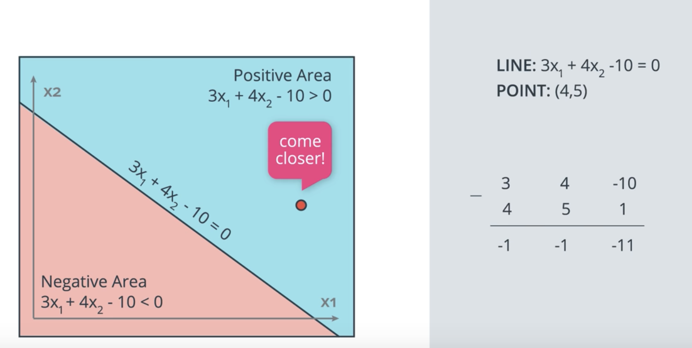
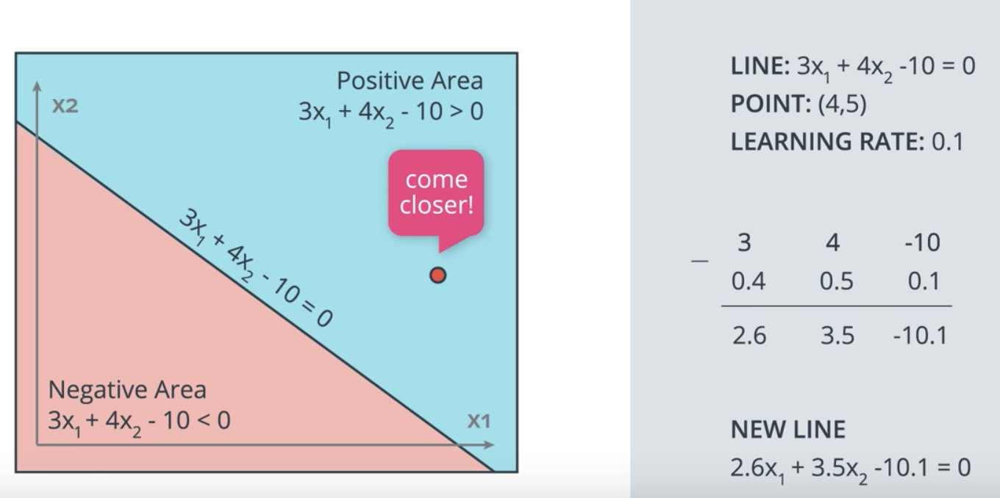
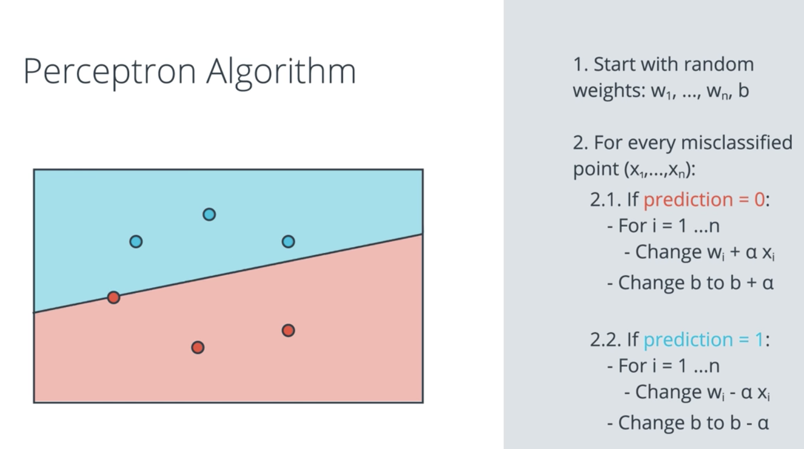
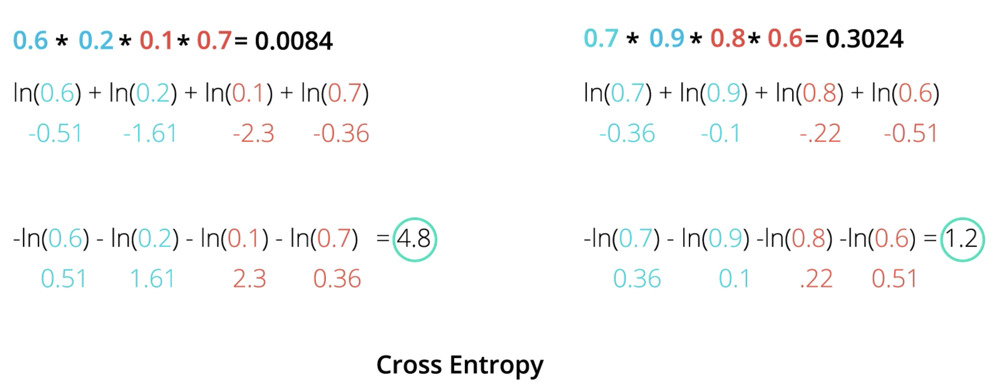
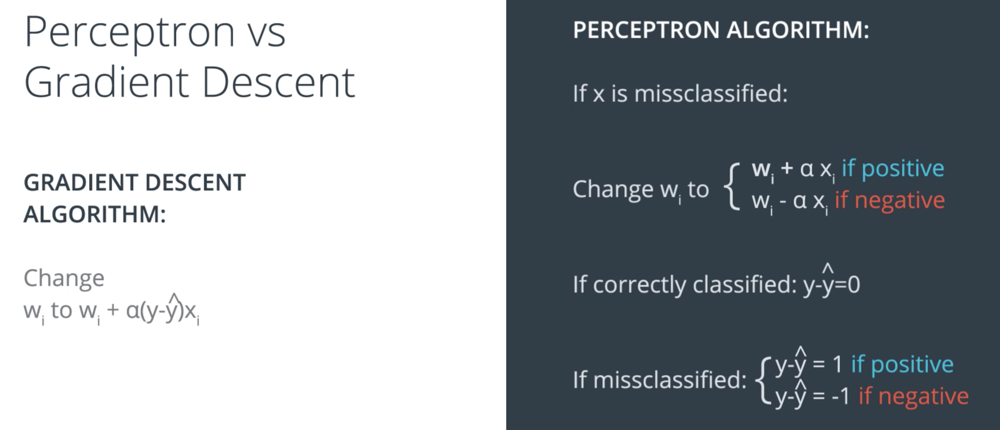

# Deep Learning

## Neural Networks

### Perceptron Trick
Consider a linear classifier and a set of points. Training our classifier shall find a line that separates the data. We will now learn a trick that modifies the equation of a line so that it comes closer to a particular point.

Let's consider the line $3x_{1} + 4x_{2} - 10 = 0$ and a point $(4,5)$.

We can now move to line closer to the point by doing the following:

The new line will be: $-1x_{1} - 1x_{2} - 10 = 0$  
However, doing this will move the line drastically towards the point and eventually misclassify many other points. To overcome this problem we want to make small steps towards this point. This can be done by the introduction of a learning rate.

### Perceptron Algorithm

### Sigmoid Activation Function

In order to use Gradient Descent we need to have a continuous error function. In order to do this, we also need to move from discrete predictions to continuous predictions.  

Therefore, we will replace the step function by the sigmoid function.

$Sigmoid(x) = \frac{1}{1+e^{-x}}$

### Maximum Likelihood

Let's assume we have two models. One that tells me that the probability of a given label is 0.8% and another one that tells me that the probability is 0.55%. The question which model is more accurate given a series of events.

The best (most accurate) model is the model that gives us the highest probability that an event happened to us. This is called "Maximum Likelihood".

But how can we maximize such a probability?  
Well, first we calculate the probabilities of a given point and multiply them together. However, the product of those probabilities might become very small and we might have problems to deal with it.  
One way to overcome this problem is the conversion of product into sums by applying the logarithm.

### Cross Entropy

When taking the logarithm of a number between 0-1 the logarithm will be a negative number. Therefore, it makes sense to consider the negative of the logarithm to get positive numbers. This is why Cross Entropy is often called _negative log-likelihood_.

**Two classes:**  
$\text{Cross Entropy} = - \sum{y_{i} \cdot ln(p_{i})+(1-y_{i}) \cdot ln(1-p_{i})}$

**Multiple classes:**  
$\text{Cross Entropy} = - \sum{\sum{ y_{ij} \cdot ln(p_{ij})}}$

### Logistic Regression

One way to compute the error function is by using the following formula:

$\text{Error Function} = -\frac{1}{m}{\sum{ (1-y_{i}) \cdot ln(1-y_{i}) + y_{i} \cdot ln(p_{ij})}}$

**Note:**

- If the label should be classified "1": $y_{i}$ = 1 and therefore the first term becomes 0.
- If the label should be classified "0": $y_{i}$ = 0 and therefore the second term becomes 0.

### Perceptron vs Gradient Descent

As we can we can see Perceptron Algorithm is actually the same as Gradient Descent. The only difference is that in Perceptron Learning we $\widehat{y}$ can only be 1 or 0.

## Deep Neural Networks

### Regularization

Let's consider the following two functions:

You might wonder which functions is a better predictor for your problem.  
For example: Let's assume we want to classify the points (-1,-1) and (1,1). If we calculate the prediction, we will see that the prediction of the second function is almost close to 1/-1. Therefore, it seems that #2 is the better predictor. However, this is not true since the slope of the second function is much steeper and that's why it becomes much harder to do gradient descent (the derivates are mostly close to 0).  
Therefore, in order to do gradient descent properly, we prefer the model on the left. The model on the right is too certain!

How can we avoid such functions?  
We want to punish large coefficients. Therefore, we add an additional term to our error function that penalizes large weights.

### Dropout

When we train our network it might happen that some parts of a network tend to develop much larger weights than other parts. So the part with large weights starts to dominate our training while the other part gets "ignored".  
A common way to prevent this is called "dropout". By randomly removing some weights (connections) in each epoch we make sure that all parts of the network get trained.

https://www.cs.toronto.edu/~hinton/absps/JMLRdropout.pdf

### Vanishing Gradients and other activation functions

The sigmoid function often has the problem of "vanishing gradients". For instance, if we calculate the gradient on the right, we will see that the slope is quite flat and therefore the gradient is almost 0. This becomes even worse in Multi-Layer-NN since we multiple the products of gradients when performing backpropagation. So we end up making even tinier steps.

**Alternative activation functions:**  

- Hyperbolic tangent  
  
- RELU

### Momentum

The idea of momentum is to overcome the local minimum problem by "momentum" and "determination". Therefore, we take the weighted average of the last X gradients which allows us to get over "humps".

### Keras Optimizers

- SGD  
  This is Stochastic Gradient Descent. It uses the following parameters:
  
  - Learning rate
  - Momentum  
    This takes the weighted average of the previous steps, in order to get a bit of momentum and go over bumps, as a way to not get stuck in local minima).
  - Nesterov Momentum (This slows down the gradient when it's close to the solution).

- Adam  
  Adam (Adaptive Moment Estimation) uses a more complicated exponential decay that consists of not just considering the average (first moment), but also the variance (second moment) of the previous steps.

- RMSProp  
  RMSProp (RMS stands for Root Mean Squared Error) decreases the learning rate by dividing it by an exponentially decaying average of squared gradients.

## Convolutional Neural Networks

### Model Validation

We typically break our dataset into three sets:

- **Train Set**  
  We use this set for fitting the model's weights
  
- **Validation Set**  
  Tells us if our chosen model is performing well. Usually evaluated in each epoch.
  Since the model is not used for deciding the weights, we can use it to detect overfitting.
  
- **Test Set**  
  The idea of the test set is that when we go to test the model, we look at data we have truly never seen before. 
  Although the validation data are not used to train the model, the model is biased in favour of the validation set.
  
 
### Image Augmentation

We want our network to learn an invariant representation of our objects. This means that the position of an object should not matter.
In other words we want to have:

- Scale invariance
  Independence of the object's size
- Rotation invariance
  Rotation of the object should not matter

Combined both terms together we call this: **Translation invariance**
