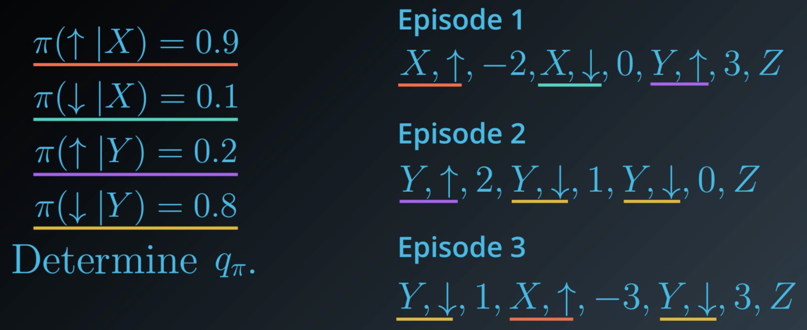
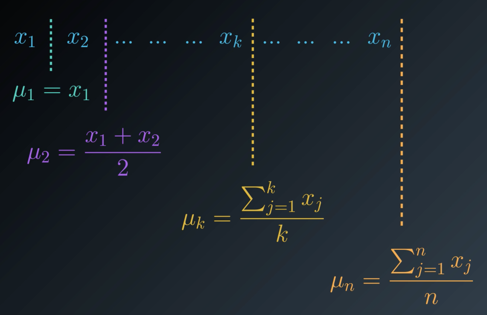
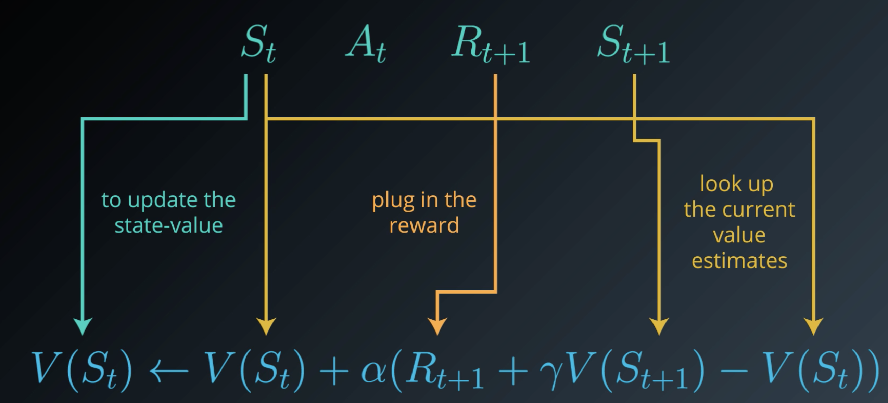
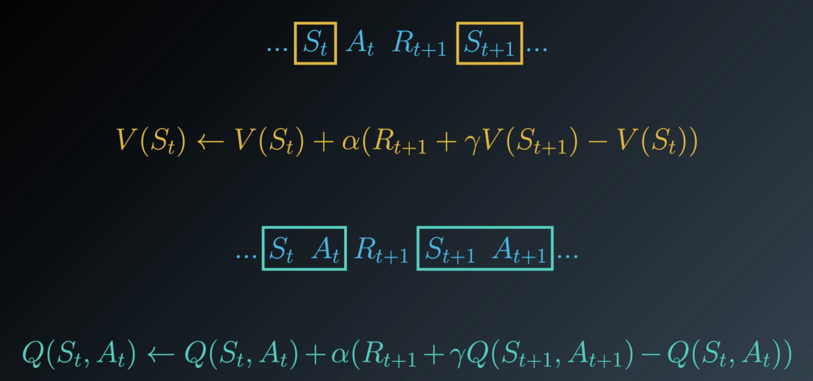
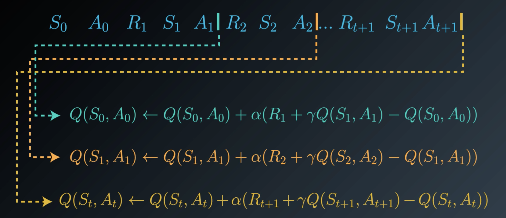

# Reinforcement Learning

## RL Framework

### How does the reinforcement setting look like?

Reinforcement learning is all about learning from try and error. The learning framework can be described by an **agent** learning to interact with an **environment**. We assume that time involves in discrete time steps.
At the initial time step, the agent observes the environment. Then, it must select an appropriate action. In the next step (in response to the agent's action) the environment presents a new situation to the agent. It also provides the agent with some kind of reward. In response, the agent must choose an action.

The goal is to take actions that **maximize** the **expected cumulative reward**.

### Episodic and continuous tasks

If a problem has a well-defined ending point we call it an **episodic tasks**. For example, a chess game has a finite number of moves. The sequence of interactions is typically called an **episode**. It's always able to start from scratch like it's being reborn in the environment, but with the added knowledge from the past life.

**Continuing tasks** are ones that never end. For example, an algorithm that buys stocks and response to the financial market. In this case, the agent lives forever and it has to choose actions while simultaneously interacting with the environment.

### Rewards hypothesis

The term "reinforcement" originally comes from behavioral science. It refers to a stimulus that is delivered immediately after a behavior to make the behavior more likely to occur in the future. 

**Reward hypothesis:**  
All goals can be framed as the maximization of **expected** cumulative reward.

Let's consider an example to understand what this means in practice. Let's say we want to teach a robot to walk.

**What are the actions?**  
They are forces that the robot applies to its joints ("Gelenke").

**What are the states?**  
- The current position and volocities of all joints  
- Measurements of the ground  
- Contact sensor data (Used to determine whether the robot is still walking or falling over)

**What are the rewards?**  
We design the reward as a feedback algorithm as a feedback mechanism that tells the agent the appropriate movement.

$r = min(v_x,v_{max}) - 0.005(v_y^2 + v_z^2) - 0.05 y^2 - 0.02 ||u||^2 + 0.02$

Let's take a closer look at the reward function to understand what the individual components are.

$min(v_x,v_{max})$ ... Reward proportional to the robot's forward velocity. If it moves faster, it gets more reward (up to a certain limit denoted by $v_{max}$)

$0.02 ||u||^2$ ... Penalized by the amount of torque applied to each joint

$0.005(v_y^2 + v_z^2)$ ... Since the agent is designed to move forward, we want to penalize vertical movements.

$0.05 y^2$ ... Tracks whether the body move away from the center of its track. We want to keep the humanoid as close to the center as possible.

$0.02$ ... At every time step the agent receives some positive award if the humanoid has not yet fallen. If the robot falls, the episode terminates meaning that the humanoid missed a opportunity to collect more award.

### Cumulative reward

The question we are going to answer in this section is whether it's enough to maximize the reward at each time step or if it's always necessary to look at the **cumulative sum**.

Let's try to understand this using the walking robot example. If the robot only looked at the reward at a single time step, he would simply try to move as fast as possible without falling immediately. That could work well in the short term. However, it's possible that that the agent learns a movement that makes him move quickly, but forces him to fall in a short time. Hence, the individual award might be high, but the cumulative award is still small meaning that the agent can't walk.  
Therefore, we always need to look at short term and long term consequences.

### Discounted reward

If we look at a time step $t$ we will notice that all the rewards in the past have already been decided. The sum of rewards is called **return**. Only future rewards are in the agents control.

Since the events in the future are the ones that the agent can still decide, we really care about maximising the **expected** return. In other words, we can say that:  
At time step $t$ the agent takes an action $A_t$ that maximizes the **expected** return $G_t$.

$G_t = R_{t+1} + R_{t+2} + R_{t+3} + ...$

In case of **discounted rewards** we want give a much greater weight to steps the occurred much earlier in time.

${G_t}_{discount} = R_{t+1} + 0.9 \cdot R_{t+2} + 0.81 \cdot R_{t+3} + ...$

We often write it like... 

${G_t}_{discount} = R_{t+1} + \gamma \cdot R_{t+2} + \gamma^2 \cdot R_{t+3} + \gamma^3 R_{t+4}...$ where $\gamma \in [0,1]$

$\lambda$ is called the **discount rate**

By choosing $\lambda$ appropriately, we can decide how far we the agent should look into the future.

**Note:** The larger $\gamma$ gets, the more we care about the future (try it by plugging in values for $\gamma$)

**But what is the initiation behind that?**  
It's because events that occur soon are probably more predictable.  
Let's illustrate it by means of an example. Let's imagine somebody tells you that he is going to give you a marshmallow right now. Furthermore, he also tells you that he will probably give you one tomorrow as well. Of course, you would immediately take the marshmallow you get today. So, whatever today's marshmallow is worth to you, tomorrow's marshmallow is probably only worth a percentage of that to you.

### Markov Decision Process

A (finite) Markov Decision Process is defined by:

- a (finite) set of states $S$
- a (finite) set of actions $A$
- a (finite) set of rewards $R$
- the one-step dynamics of the environment  
  $p(s',r|s,a) = \mathbb{P}(S_{t+1} = s', R_{t+1}=r|S_t=s,A_t=a)$ for all $s$,$s'$,$a$ and $r$
- a discount rate $\lambda \in [0,1]$

#### How do we encode the solution to a problem?
So far, we've learned that a MDP comprises of states and actions. In every state we can take a certain action and this action will take us into another state. Formally, we can see this as a mapping $\pi: S \rightarrow A$. Such a mapping is also called a **policy**. So, a policy simple tells for every state which action we take next. 

To be precise we should differ between **stochastic policies** and **deterministic policies**. Stochastic policies allow to choose actions randomly.

**Deterministic policy:**  
$\pi: S \rightarrow A$

**Stochastic policy:**  
$\pi: S \times A \rightarrow [0,1]$

$\pi(a|s) = \mathbb{P}[A_t=a|S_t=s]$

### State-value function

The state-value function is defined as follows:

$v_{\pi} = \mathbb{E_{\pi}}[G_t|S_t=s]$

So, the state-value function provides us with the expected return given a policy $\pi$ for an agent starting in state $s$.

### Bellman equations

We saw that the value of any state in a MDP can be calculated as the sum of the immediate reward and the (discounted) value of the next state.

So, for a given policy $\pi$ the expected value of the return starting in state $s$ is simply: $v_{\pi} = \mathbb{E_{\pi}}[G_t|S_t=s] = R_{t+1} + R_{t+2} + ...$.

Furthermore, it's important to see that this is equivalent to: $v_{\pi} = \mathbb{E_{\pi}}[G_t|S_t=s] = R_{t+1} + R_{t+2} + ... = \mathbb{E_{\pi}}[R_{t+1} + \lambda v_{\pi}(S_{t+1})|S_t=s]$

An equation in this form (immediate reward + discounted value of the state the state that follows) is called a **Bellman equation**.

### Optimality

$\pi' \geq \pi$ if and only if $v_{\pi'}(s) \geq v_{\pi}(s)$ for all $s \in S$

An **optimal policy** $\pi_*$ satisfies $\pi_* \geq \pi$ for all $\pi$.

### Action-value function

The action-value function is similar to the state-value function. However, the state-value function yields the expected return if the agent starts in state $s$, takes an action $a$ and then follows the policy for all future time steps.

The action-value function is typically denoted by $q$. It's also true that $v_{\pi}(s) = q_{\pi}(s,\pi(s))$ holds for all $s \in S$.

$q_{\pi}(s,a) = \mathbb{E}_{\pi}[G_t|S_t=s,A_t=a]$ 

All optimal policies have the same action-value function $q_*$ called the **optimal action-value function**.

## Dynamic Programming

**Dynamic programming** denotes a simplification of the reinforcement learning setting. We assume that the agent has full knowledge of environment (Markov decision process) that characterises the environment. Therefore, this is much easier than the reinforcement learning setting, where the agent initially knows nothing about how the environment decides state and reward and must learn entirely from interaction how to select actions.)

### Iterative policy evaluation

Iterative policy evaluation is an algorithm used in the dynamic programming setting to estimate the state-value function $v_{\pi}$ corresponding to a policy $\pi$. In this approach, a Bellman update is applied to the value function estimate until the changes to the estimate are nearly imperceptible.

**Basic idea**

Let's say we want to evaluate the state-value function of a *stochastic* policy of the following example:

As we know, stochastic policies deal with probabilities. Every action we take in a state has a certain probability. For simplicity, let's assume that every state has a probability of 50%.

$\pi(right|s_1) = 0.5$  
$\pi(down|s_1) = 0.5$  
$\pi(left|s_2) = 0.5$  
$\pi(down|s_2) = 0.5$  
$\pi(up|s_3) = 0.5$  
$\pi(right|s_3) = 0.5$

Hence, we can calculate the expected return using the state-value function:

$v_{\pi}(s_1) = 0.5 \cdot (-1 + v_{\pi}(s_2)) + 0.5 \cdot (-3 + v_{\pi}(s_3))$  
$v_{\pi}(s_2) = 0.5 \cdot (-1 + v_{\pi}(s_1)) + 0.5 \cdot (5 + v_{\pi}(s_4))$  
$v_{\pi}(s_3) = 0.5 \cdot (-1 + v_{\pi}(s_1)) + 0.5 \cdot (5 + v_{\pi}(s_4))$  
$v_{\pi}(s_4) = 0$

Finally, after solving the system of equations we get:

$v_{\pi}(s_1) = 0$  
$v_{\pi}(s_2) = 2$  
$v_{\pi}(s_3) = 2$  
$v_{\pi}(s_4) = 0$

**What's the problem with this approach?**  
Calculating the expected return for every state wasn't difficult in this example. However, if the state space grows, solving such a system of equations directly becomes increasingly difficult. We, therefore, prefer an iterative approach which we are going to discuss now.

**Solving the example by means of an iterative approach**  
We first start by setting the return of every state to 0.

Next, we take the state-value functions we had before and use them to guess the return of the corresponding state. We start with the state-function for state $s_1$

$V(s_1) = 0.5 \cdot (-1 + V(s_2)) + 0.5 \cdot (-3 + V(s_3))$  

After, plugging in our current estimates we get:

$V(s_1) = 0.5 \cdot (-1 + 0) + 0.5 \cdot (-3 + 0) = -2$  

We continue with state $s_2$:

$V(s_2) = 0.5 \cdot (-1 + V(s_1)) + 0.5 \cdot (5 + V(s_4))$  
$V(s_2) = 0.5 \cdot (-1 + -2) + 0.5 \cdot (5 + 0) = 1$ 

And, finally, we do the same for $s_3$:

$V(s_3) = 0.5 \cdot (-1 + V(s_1)) + 0.5 \cdot (5 + V(s_4))$  
$V(s_3) = 0.5 \cdot (-1 + -2) + 0.5 \cdot (5 + 0) = 1$ 

We keep updating the return for every state until there's no change. This is the key idea behind an algorithm called **Iterative policy evaluation**.

> **Iterative policy evaluation**
> 
> **Input:** MDP, policy $\pi$  
> **Output:** state-value function
> 
> V(s) = 0 for all $s \in S^+$
> 
> **repeat until $\delta < \theta$:**  
> $\hspace{0.5cm}$ $\Delta = 0$  
> 
> $\hspace{0.5cm}$ **for** $s \in S$:  
> $\hspace{1cm}$ $v = V(s)$  
> $\hspace{1cm}$ $V(s) = \sum_{a \in A(s)} \pi(a|s) \sum_{s' \in S, r \in R} p(s',r|s,a)(r + \lambda V(s'))$  
> $\hspace{1cm}$ $\Delta = max(\Delta, |v-V(s)|)$
> 
> return $V$

### Estimation of action values

In the dynamic programming setting, it is possible to quickly obtain the action-value function $q_{\pi}$ from the state-value function $v_{\pi}$ with the equation: $q_{\pi}(s,a) = \sum_{s' \in S, r \in R} p(s',r|s,a) \cdot (r + \gamma V(s'))$

> **Estimation of action values**
> 
> **Input:** state-value function V  
> **Output:** action-value function Q
> 
> **for $s \in S$:**  
> $\hspace{0.5cm}$ **for $ a \in A(s)$:**  
> $\hspace{1cm} Q(s,a) = \sum_{s' \in S, r \in R} p(s',r|s,a) \cdot (r + \gamma V(s'))$  
> 
> return $Q$

### Policy improvement

Policy improvement takes an estimate V of the action-value function $v_{\pi} $ corresponding to a policy $\pi$, and returns an improved (or equivalent) policy $\pi'$, where $\pi' \geq \pi$.  
The algorithm first constructs the action-value function estimate $Q$. Then, for each state $s \in S$, you need only select the action $a$ that maximizes $Q(s,a)$. In other words, $\pi'(s) = \text{argmax}_{a \in A(s)} Q(s,a)$ for all $s \in S$.

> **Policy Improvement**
> 
> **Input:** MDP, value function V  
> **Output:** policy $\pi'$
> 
> **for** $s \in S$  
> $\hspace{0.5cm}$ **for** $a \in A(s)$  
> $\hspace{1cm}$ $Q(s,a) = \sum_{s' \in S, r \in R} p(s',r|s,a) \cdot (r + \gamma V(s'))$  
> $\hspace{0.5cm}$ $\pi'(s) = \text{argmax}_{a \in A(s)} Q(s,a)$
> 
> **return** $\pi'$

### Policy iteration

Policy iteration is an algorithm that can solve an MDP in the dynamic programming setting. It proceeds as a sequence of policy evaluation and improvement steps, and is guaranteed to converge to the optimal policy (for an arbitrary finite MDP).

> **Policy iteration**
> 
> **Input:** MDP, small positive number $\theta$  
> **Output:** policy $\pi \approx \pi_*$
> 
> Initialize $\pi$ arbitrarily (e.g. $\pi(a|s) = \frac{1}{|A(s)|}$ for all $s \in S$ and $a \in A(s)$) 
> 
> policy-stable = false
> 
> **repeat**  
> $\hspace{0.5cm}$ $V$ = Policy-Evaluation(MDP,$\pi$,$\theta$)  
> $\hspace{0.5cm}$ $\pi'$ = Policy-Improvement(MDP,$\pi$,$\theta$)  
> $\hspace{0.5cm}$**if** $\pi = \pi'$  
> $\hspace{1cm}$ policy-stable = true  
> $\hspace{0.5cm}\pi = \pi'$  
> **until** policy-stable = true
> 
> **return** $\pi$

### Truncated policy iteration

**Truncated policy iteration** is an algorithm used in the dynamic programming setting to estimate the state-value function $v_\pi$ corresponding to a policy $\pi$. In this approach, the evaluation step is stopped after a fixed number of sweeps through the state space. We refer to the algorithm in the evaluation step as **truncated policy evaluation**.

> **Truncated policy evaluation**
> 
> **Input:** MDP, policy $\pi$, value function $V$, positive integer max-iterations  
> **Output:** $V \approx v_{\pi}$
> 
> counter = 0  
> **while** counter < max-iterations  
> $\hspace{0.5cm}$**for** $s \in S$  
> $\hspace{1cm}$ $V(s) = \sum_{a \in A(s)} \pi(a|s) \sum_{s' \in S, r \in R} p(s',r|s,a) \cdot (r + \gamma V(s'))$  
> $\hspace{0.5cm}$counter = counter + 1
> 
> **return** $V$

> **Truncated policy iteration**
> 
> **Input:** MDP, positive integer max-iterations, small positive number $\Theta$  
> **Output:**  policy $\pi \approx \pi_*$
> 
> Initialize $V$ arbitrarily (e.g. $V(s) = 0$ for all $s \in S^+$)  
> Initialize $\pi$ arbitrarily (e.g. $\pi(a|s) = \frac{1}{|A(s)|}$ for all $s \in S$ and $a \in A(s)$)
> 
> **do**  
> $\hspace{0.5cm}$ $\pi$ = Policy-Improvement(MDP,$V$)  
> $\hspace{0.5cm}$ $V_{old} = V$  
> $\hspace{0.5cm}$ $V$ = Truncated-Policy-Evaluation(MDP, $\pi$, $V$, max-iterations)  
> **while** $max_{s \in S} |V(s) - V_{old}(s)| < \Theta$
> 
> **return** $\pi$

### Value iteration

Value iteration is an algorithm used in the dynamic programming setting to estimate the state-value function $v_\pi$ corresponding to a policy $\pi$. In this approach, each sweep over the state space simultaneously performs policy evaluation and policy improvement.

> **Value iteration**
> 
> **Input:** MDP, small positive number $\Theta$  
> **Output:** policy $\pi \approx \pi_*$
> 
> Initialize $V$ arbitrarily (e.g. $V(s) = $ for all $s \in S^+$)
> 
> **do**  
> $\hspace{0.5cm}$ $\Delta = 0$  
> $\hspace{0.5cm}$ **for** $s \in S$  
> $\hspace{1cm}$ $v = V(s)$  
> $\hspace{1cm}$ $V(s) = max_{a \in A(s)}\sum_{s' \in S, r \in R} p(s',r|s,a) \cdot (r + \gamma V(s'))$  
> $\hspace{1cm}$ $\Delta = max(\Delta,|v-V(s)|)$  
> **while** $\Delta < \Theta$
> 
> $\pi$ = Policy-Improvement(MDP,$V$)
> 
> **return** $\pi$

## Monte Carlo methods

We learned that in the dynamic programming setting the agent has full knowledge of the environments dynamics. In real-world problem this is often not the case. Therefore, we need to think of other methods that can find the right policy for solving a problem without knowing the environments dynamics. A way to do this is **Monte Carlo prediction**.

### Predicting state values

First let's recall the problem we are trying to solve. We have an agent interacting with an environment. Time is broken into discrete time steps and at every time steps it receives a reward. If we look at a problem discardable by an *episodic* sequence, the agent always stops at some time step $T$ when it encounters a terminal state.  
Similar to the DP setting we try to find a policy in order to maximises expected cumulative return $\mathbb{E}_{\pi} = \sum_{t=1}^T R_t$.

In the DP setting we simply estimated the expected cumulative return using the state-value function $v_{\pi}$. This was is since we knew the environments dynamics. However, as this is not the case in the MC setting anymore, we need to find a different strategy.

If we use a given policy $\pi$ to estimate $v_{\pi}$ by generating episodes based on $\pi$, we call this an **on-policy method**. On the other hand, there exist so-called **off-policy methods**  which generate episodes based on a policy $b$ where $b \neq \pi$. We then use the generated episodes (based on policy $b$) to estimate $v_{\pi}$.

**Example:**

Let's assume we are working with episodic tasks an the MDP has three states.

$S^+ = \{X,Y,Z\}$ $\hspace{1cm}$ $Z$ is a terminal state

Furthermore, we can take two actions. Up or down.

$A = \{Up, Down \}$

We know want to determine the state-value function $v_{_\pi}$ where $\pi$ is ...

$\pi(X) = Down$  
$\pi(Y) = Up$

We now can calculate the return for various episodes (different initial states).

#### Example: Estimating $v_{\pi}(X)$:

**Episode 1**  
**X**, Up, -2, Y, Down, 0, Y, Down, 3, Z $\hspace{1cm}\rightarrow\hspace{1cm}$ -2 + 0 + 3 = 1

**Episode 2**  
Y, Down, 2, Y, Down, 1, Y, Down, 0, Z

**Episode 3**  
Y, Down, 1, **X**, Up, -3, Y, Down, 3, Z $\hspace{1cm}\rightarrow\hspace{1cm}$ -3 + 3 = 0

Finally, we simply calculate the average discounted return and use this as an estimate for $v_{\pi}(X)$.  
In our case $v_{\pi} = \frac{-2+0+3 + (-3) + 3}{2} = 0.5$

#### Example: Estimating $v_{\pi}(Y)$:

As we can see the status $Y$ is visited multiple times, hence it's not immediately clear how to calculate the return. In fact, we have to options:

- **Variant 1:** Only consider the first states and average them
- **Variant 2:** Follow all visits and average them

#### Variante 1:

**Episode 1**  
X, Up, -2, **Y**, Down, 0, Y, Down, 3, Z $\hspace{1cm}\rightarrow\hspace{1cm}$ 0 + 3 = 3

**Episode 2**  
**Y**, Down, 2, Y, Down, 1, Y, Down, 0, Z $\hspace{1cm}\rightarrow\hspace{1cm}$ 2 + 1 + 0 = 3

**Episode 3**  
**Y**, Down, 1, X, Up, -3, Y, Down, 3, Z $\hspace{1cm}\rightarrow\hspace{1cm}$ 1 - 3 + 3 = 1

$v_{\pi}(Y) = \frac{3+3+1}{3} = \frac{7}{3}$

#### Variante 2:

**Episode 1**  
X, Up, -2, **Y**, Down, 0, **Y**, Down, 3, Z $\hspace{1cm}\rightarrow\hspace{1cm}$ 0 + 3 = 3; 3 = 3

**Episode 2**  
**Y**, Down, 2, **Y**, Down, 1, **Y**, Down, 0, Z $\hspace{1cm}\rightarrow\hspace{1cm}$ 2 + 1 + 0 = 3; 1 + 0 = 1; 0 = 0

**Episode 3**  
**Y**, Down, 1, X, Up, -3, **Y**, Down, 3, Z $\hspace{1cm}\rightarrow\hspace{1cm}$ 1 -3 +3 = 1; 3 = 3

$v_{\pi}(Y) = \frac{14}{7} = 2$

> **First-Visit MC prediction**
> 
> **Input:** Policy $\pi$, positive integer num-episodes  
> **Output:** value function $V$ 
> 
> Initialize $N(s) = 0$ for all $s \in S$  
> Initialize returns-sum(s) = 0 for all $s \in S$
> 
> **for** i=1 to num-episodes  
> $\hspace{0.5cm}$ Generate an episode $S_0, A_0, R_0, R_1, ..., S_T$ using $\pi$  
> $\hspace{0.5cm}$ **for** t=0 to T-1  
> $\hspace{1cm}$  **if** $S_t$ is a first visit (with return $G_t$)  
> $\hspace{1.5cm}$  $N(S_t) = N(S_t) + 1$  
> $\hspace{1.5cm}$  returns-sum($S_t$) = returns-sum($S_t$) + $G_t$
> 
> $V(s)$ = returns-sum(s) / N(s) for all $s \in S$
> 
> **return** V 

### Estimating action-values

Remember the formula for calculating the action-value function in the dynamic programming setting:  

$q_{\pi}(s,a) = \sum_{s' \in S, r \in R} p(s',r|s,a)(r + \lambda v_{\pi}(s'))$

Unfortunately, it's not possible to calculate the action-value function as we did in the dynamic programming setting since the one-step dynamics ($p(s',r|s,a)$) of our environment are unknown.

To overcome this problem we can apply a similar idea as we did for the state-value function. We look at every state-action pair and calculate the average return for corresponding pairs.

#### Example:

**Episode 1**  
**X, Up**, -2, Y, Down, 0, Y, Down, 3, Z $\hspace{1cm}\rightarrow\hspace{1cm}$ -2 + 0 + 3 = 1;

**Episode 2**  
Y, Down, 2, Y, Down, 1, Y, Down, 0, Z 

**Episode 3**  
Y, Down, 1, **X, Up**, -3, Y, Down, 3, Z $\hspace{1cm}\rightarrow\hspace{1cm}$ -3 +3 = 0

Hence, we get: $q_{\pi}(X,Up) = \frac{1}{2}$

**What to do if the same state-action pair occurs multiple times in the same episode?**  
Similar to the state-value function we can either apply the **first-visit approach** or the **every-visit** approach.

**Note:** Our algorithm will only be able to estimate the action-value for pairs "supported" by the given policy. For instance, our policy does only allow $\pi(X) = Up$ and $\pi(Y) = Down$. So, we won't be able to estimate the state value function for $q_{\pi}(X,Down)$ or $q_{\pi}(Y,Up)$.

A way to solve this would be to make sure that we don't try to evaluate the action-value function for a deterministic policy. Instead, we work with a stochastic policy.

> **First-visit MC prediction (for action values)**
> 
> **Input:** policy $\pi$, positive integer num-episodes  
> **Output:**  value function Q
> 
> Initialize N(s,a) = 0 for all $s \in S$, $a \in A(s)$  
> Initialize returns-sum(s,a) = 0 for all $s \in S$, $a \in A(s)$
> 
> **for** i=1 to num-episodes  
> $\hspace{0.5cm}$ Generate an episode $S_0, A_0, R_0, R_1, ..., S_T$ using $\pi$  
> $\hspace{0.5cm}$ **for** t=0 to T-1  
> $\hspace{1cm}$  **if** $(S_t,A_t)$ is a first visit (with return $G_t$)  
> $\hspace{1.5cm}$  $N(S_t, A_t) = N(S_t, A_t) + 1$  
> $\hspace{1.5cm}$  returns-sum($S_t$, $A_t$) = returns-sum($S_t$, $A_t$) + $G_t$
> 
> $Q(s,a)$ = returns-sum(s,a) / N(s,a) for all $s \in S$
> 
> **return** Q 

### Monte Carlo control

Our Monte Carlo control algorithm will draw inspiration from generalized policy iteration. We start with the policy evaluation step described in above section. One we have a good estimate for our action-value function we can focus ourselves finding a better policy. Unfortunately, the first-visit MC prediction algorithm takes a long time to run and it might make sense to perform the improvement earlier in the stage. For example, after every individual game of black jack.

#### The idea of an incremental mean

The slow prediction performance motivates the idea of trying to improve the policy earlier in stage. For instance, after every individual game.  
In practice, this means that we have some initial starting policy, generate an episode using this policy and estimate the action-value function. Finally, we use this action-value function to estimate a new policy which is again used to retrieve a new episode.

However, since we are iterative updating the policy and evaluating its performance on a single episode, we somehow need to keep track of "old" action-values in the action-value function. This can be done by simply averaging the values.

So, if the sequence $x_1, x_2, ... x_n$ determines the returns following the same (state, action) pair, we can simply calculate the action-value estimate as follows:

$\mu_n = \frac{\sum_{j=1}^n x_j}{n}$

If we consider this to be part of an (iterative) algorithm it some looks as follows:

Fortunately, we can rewrite this in a way that we don't have to iterate over all state-action pairs to calculate the sum.

$\mu_k = \frac{1}{k}\sum_{j=1}^k x_j = \frac{1}{k}(x_k + \sum_{j=1}^{k-1} x_j) = \frac{1}{k} (x_k + (k+1) \cdot \mu_{k-1}) = \mu_{k-1}+\frac{1}{k}(x_k-\mu_{k-1})$

> **Incremental mean algorithm**
> 
> $\mu=0$  
> $k=0$  
> 
> **while** $k <n$  
> $\hspace{0.5cm} k = k + 1$  
> $\hspace{0.5cm} \mu = \mu + \frac{1}{k}(x_k-\mu)$  

### Policy evaluation

So far, we discussed an algorithm that allows us to keep track of the running mean of a sequence of numbers. In case of policy evaluation we need to change it in a way that allows use to keep track of values for many state-action pairs. This results in the algorithm as follows:

> **Policy evaluation**
> 
> Generate an episode $S_0$, $A_0$, $R_1$, ..., $S_T$ using $\pi$
> 
> **for** $t=0$ to $T-1$  
> $\hspace{0.5cm}$ **If** $(S_t,A_t)$ is a first visit (with return $G_t$)  
> $\hspace{1cm}$ $N(S_t,A_t) = N(S_t,A_t) + 1$  
> $\hspace{1cm}$ $Q(S_t,A_t) = Q(S_t,A_t) + \frac{1}{N(S_t,A_t)}(G_t - Q(S_t,A_t))$ 

### Policy improvement

We know turn our attention to policy improvement. So far, in the dynamic programming settings we simply applied a greedy approach for finding a better policy. In other words, for each state we just pick the option with the highest value. However, if we want to combine this approach with the policy evaluation algorithm described above, we will need to make some slight amendments.

**Let's consider the following example:**

Let's say we have two doors A and B. Initially, we assume that the action-value estimate for both doors is 0. Therefore, we have to pick a door randomly in the first round. Once we open the door, we get a return. Of course, if we always apply a greed approach (meaning that we always pick to one with the largest cumulative return), we will always pick the "same" door. The problem with this approach is that we never really got a change to explore what's behind the 2nd door.

To overcome this problem, we need to come up with a stochastic policy instead of a simple greedy policy. This allows us to model a policy in a way that there remains a change to pick the 2nd door.

We call such a policy an **$\epsilon$-greedy policy**.

> **$\epsilon$-greedy policy**
> 
> $\pi(a|s) = \begin{cases} 1 - \epsilon + \frac{\epsilon}{|A(s)|} \hspace{1cm} \text{if } a=argmax_{a' \in A(s)} Q(s,a') \\ \frac{\epsilon}{A(s)} \hspace{1cm} otherwise\end{cases}$

$\epsilon$ determines the likelihood of picking a certain action. In other words, the larger $\epsilon$ is, the more likely we are to pick a non-greedy action. We pick the non-greedy action with probability $\epsilon$ and the greedy action with probability $1-\epsilon$.

### Exploration-Exploitation Dilemma
Recall that the environment's dynamics are initially unknown to the agent. Towards maximizing return, the agent must learn about the environment through interaction.

At every time step, when the agent selects an action, it bases its decision on past experience with the environment. And, towards minimizing the number of episodes needed to solve environments in OpenAI Gym, our first instinct could be to devise a strategy where the agent always selects the action that it believes (based on its past experience) will maximize return. With this in mind, the agent could follow the policy that is greedy with respect to the action-value function estimate. 

To see why this is the case, note that in early episodes, the agent's knowledge is quite limited (and potentially flawed). So, it is highly likely that actions estimated to be non-greedy by the agent are in fact better than the estimated greedy action.

With this in mind, a successful RL agent cannot act greedily at every time step (that is, it cannot always exploit its knowledge); instead, in order to discover the optimal policy, it has to continue to refine the estimated return for all state-action pairs (in other words, it has to continue to explore the range of possibilities by visiting every state-action pair). That said, the agent should always act somewhat greedily, towards its goal of maximizing return as quickly as possible. This motivated the idea of an $\epsilon$-greedy policy.

We refer to the need to balance these two competing requirements as the Exploration-Exploitation Dilemma. One potential solution to this dilemma is implemented by gradually modifying the value of \epsilonϵ when constructing $\epsilon$-greedy policies.

#### Setting the value of $\epsilon$ in theory

It makes sense for the agent to begin its interaction with the environment by favoring **exploration over exploitation**. After all, when the agent knows relatively little about the environment's dynamics, it should distrust its limited knowledge and explore, or try out various strategies for maximizing return. With this in mind, the best starting policy is the equiprobable random policy, as it is equally likely to explore all possible actions from each state. You discovered in the previous quiz that setting $\epsilon$ = 1 yields an $\epsilon$-greedy policy that is equivalent to the equiprobable random policy.

As you read in the above section, in order to guarantee convergence, we must let $\epsilon_i 
$ decay in accordance with the GLIE conditions. But sometimes "guaranteed convergence" isn't good enough in practice, since this really doesn't tell you how long you have to wait! It is possible that you could need trillions of episodes to recover the optimal policy, for instance, and the "guaranteed convergence" would still be accurate.

Even though convergence is not guaranteed by the mathematics, you can often get better results by either:

- using fixed $\epsilon$, or
- letting $\epsilon_i$ decay to a small positive number, like 0.1.

This is because one has to be very careful with setting the decay rate for $\epsilon$; letting it get too small too fast can be disastrous. If you get late in training and $\epsilon$ is really small, you pretty much want the agent to have already converged to the optimal policy, as it will take way too long otherwise for it to test out new actions.

#### Greedy in the Limit with Infinite Exploration (GLIE)

In order to guarantee that MC control converges to the optimal policy $\pi_*$, we need to ensure that two conditions are met. We refer to these conditions as **Greedy in the Limit with Infinite Exploration (GLIE)**. 

In particular, if:

- every state-action pair s,a (for all $s \in S$ and $a \in A$) is visited infinitely many times, and
- the policy converges to a policy that is greedy with respect to the action-value function estimate $Q$

then MC control is guaranteed to converge to the optimal policy (in the limit as the algorithm is run for infinitely many episodes). These conditions ensure that:

- the agent continues to explore for all time steps, and
- the agent gradually exploits more (and explores less).

One way to satisfy these conditions is to modify the value of $\epsilon$ when specifying an $\epsilon$-greedy policy. In particular, let $\epsilon_i$ correspond to the i-th time step. Then, both of these conditions are met if:

- $\epsilon_i > 0$ for all time steps i, and
- $\epsilon_i$ decays to zero in the limit as the time step i approaches infinity 

For example, to ensure convergence to the optimal policy, we could set $\epsilon_i = \frac{1}{I}$.

#### Setting the value of $\epsilon$ in practice

In order to guarantee convergence, we must let $\epsilon_i$ decay in accordance with the GLIE conditions. But sometimes "guaranteed convergence" isn't good enough in practice, since this really doesn't tell you how long you have to wait! It is possible that you could need trillions of episodes to recover the optimal policy, for instance, and the "guaranteed convergence" would still be accurate!

Even though convergence is **not** guaranteed by the mathematics, you can often get better results by either:

- using fixed $\epsilon$
- letting $\epsilon_i$ decay to a small positive number, like 0.1.

This is because one has to be very careful with setting the decay rate for $\epsilon$; letting it get too small too fast can be disastrous. If you get late in training and $\epsilon$ is really small, you pretty much want the agent to have already converged to the optimal policy, as it will take way too long otherwise for it to test out new actions!

*The behavior policy during training was epsilon-greedy with epsilon annealed linearly from 1.0 to 0.1 over the first million frames, and fixed at 0.1 thereafter.*

### GLIE MC control algorithm

By combining the stuff we learned we can now come up with the GLIE MC control algorithm.

> **GLIE MC control**
> 
> **Input:** positive integer num-episodes  
> **Output:**  policy $\pi$
> 
> Initialize Q(s,a) = 0 for all $s \in S$, $a \in A(s)$  
> Initialize N(s,a) = 0 for all $s \in S$, $a \in A(s)$  
> 
> **for** i=1 to num-episodes  
> $\hspace{0.5cm}$ $\epsilon = \frac{1}{i}$  
> $\hspace{0.5cm}$ $\pi$ = $\epsilon$-greedy(Q)  
> 
> $\hspace{0.5cm}$ Generate an episode $S_0, A_0, R_0, R_1, ..., S_T$ using $\pi$  
> 
> $\hspace{0.5cm}$ **for** t=0 to T-1  
> $\hspace{1cm}$  **if** $(S_t,A_t)$ is a first visit (with return $G_t$)  
> $\hspace{1.5cm}$  $N(S_t, A_t) = N(S_t, A_t) + 1$  
> $\hspace{1.5cm}$  $Q(S_t, A_t) = Q(S_t, A_t) + \frac{1}{N(S_t,A_t)}(G_t - Q(S_t, A_t))$ 
> 
> **return** $\pi$

### Constant-alpha

Currently, our update step for policy evaluation looks a bit like this:

$Q(S_t, A_t) + \frac{1}{N(S_t,A_t)}(G_t - Q(S_t, A_t))$

We now want to try to improve this step. When taking a closer look at the function we notice that $G_t$ describes the most recently sampled return while $Q(S_t,A_t)$ describes the expected return.

Let's say $\delta_t = G_t - Q(S_t, A_t)$. This difference can be seen as an error term. 

If $\delta > 0$, we know that the action-value is too low. Hence, we need to increase $Q(S_t, A_t)$. If $\delta < 0$, we have to decrease $Q(S_t, A_t)$.

So far, we increased/decreased $Q(S_t, A_t)$ by an amount proportional to $\frac{1}{N(S_t,A_t)}$. This also means that with an increasing number of samples, the most recent return has less affect on the average.

Hence, it makes sense to use a constant step size $\alpha$ instead. This ensured that returns that arrive later are more emphasized than ones returned earlier. This is important since the policies are constantly changing and becoming better and better every time.

> **Constant incremental algorithm**
> 
> $\mu=0$  
> $k=0$  
> 
> **while** $k <n$  
> $\hspace{0.5cm} k = k + 1$  
> $\hspace{0.5cm} \mu = \mu + \alpha \cdot (x_k-\mu)$  

**Note:**

You should always set the value for $\alpha$ to a number greater than zero and less than (or equal to) one.

- If $\alpha$=0, then the action-value function estimate is never updated by the agent.
- If $\alpha=1$, then the final value estimate for each state-action pair is always equal to the last return that was experienced by the agent (after visiting the pair).
- Smaller values for $\alpha$ encourage the agent to consider a longer history of returns when calculating the action-value function estimate. Increasing the value of $\alpha$ ensures that the agent focuses more on the most recently sampled returns.

Note that it is also possible to verify the above facts by slightly rewriting the update step as follows:

$Q(S_t,A_ t) = (1−\alpha) \cdot Q(S_t,A_t)+\alpha \cdot G_t)$

where it is now more obvious that $\alpha$ controls how much the agent trusts the most recent return $G_t$ over the estimate $Q(S_t,A_t)$ constructed by considering all past returns.

**IMPORTANT NOTE:** It is important to mention that when implementing constant-$\alpha$ MC control, you must be careful to not set the value of $\alpha$ too close to 1. This is because very large values can keep the algorithm from converging to the optimal policy $\pi_*$. However, you must also be careful to not set the value of $\alpha$ too low, as this can result in an agent who learns too slowly. The best value of $\alpha$ for your implementation will greatly depend on your environment and is best gauged through trial-and-error.

### Constant-alpha GLIE MC control algorithm

> **Constant-alpha GLIE MC control**
> 
> **Input:** positive integer num-episodes  
> **Output:**  policy $\pi$
> 
> Initialize Q(s,a) = 0 for all $s \in S$, $a \in A(s)$  
> Initialize N(s,a) = 0 for all $s \in S$, $a \in A(s)$  
> 
> **for** i=1 to num-episodes  
> $\hspace{0.5cm}$ $\epsilon = \frac{1}{i}$  
> $\hspace{0.5cm}$ $\pi$ = $\epsilon$-greedy(Q)  
> 
> $\hspace{0.5cm}$ Generate an episode $S_0, A_0, R_0, R_1, ..., S_T$ using $\pi$  
> 
> $\hspace{0.5cm}$ **for** t=0 to T-1  
> $\hspace{1cm}$  **if** $(S_t,A_t)$ is a first visit (with return $G_t$)  
> $\hspace{1.5cm}$  $N(S_t, A_t) = N(S_t, A_t) + 1$  
> $\hspace{1.5cm}$  $Q(S_t, A_t) = Q(S_t, A_t) + \alpha (G_t - Q(S_t, A_t))$ 
> 
> **return** $\pi$

## Temporal difference learning

We can see temporal difference learning as learning from interaction like humans do meaning that the **agent is not allowed to take a break** for evaluation and improvement. Monte Carlo learning, for example, needed those breaks. In other words, the main idea of TD learning is that if an agent is playing chess, it will always (at every move) be able to estimate the probability that it is winning the game.

### TD(0) prediction

So far, in Monte Carlo learning we updated the state-action values using the following update rule:

$Q(S_t, A_t) = Q(S_t, A_t) + \alpha \cdot (G_t - Q(S_t, A_t))$ 

Similarly, we can come up with an analogous equation to keep track of the state values.

$V(S_t) = V(S_t) + \alpha \cdot (G_t - V(S_t)$

Remember that the idea behind this line is that the value of any state is defined as $v_\pi(s) = \mathbb{E}_\pi[G_t|S_t=s]$.  

Furthermore, $G_t$ is defined as follows: ${G_t} = R_{t+1} + \gamma \cdot R_{t+2} + \gamma^2 \cdot R_{t+3} + \gamma^3 R_{t+4}...$

Next, remember that the Bellman equation tells us that: $\mathbb{E_{\pi}}[G_t|S_t=s] = R_{t+1} + R_{t+2} + ... = \mathbb{E_{\pi}}[R_{t+1} + \lambda v_{\pi}(S_{t+1})|S_t=s]$

The Bellman equation gives us a way to express the value of any state in terms of the values of the states that could potentially follow. So, what we could do is that instead of averaging sampled returns, we average the sampled value of the sum of the immediate reward plus the discounted value of the next state.

$V(S_t) = V(S_t) + \alpha \cdot (R_{t+1} + \lambda v_{\pi}(S_{t+1}) - V(S_t)$

**This allows us to update the state value after every time step. We don't have to wait until the end of the episode to update the values.**

#### How to perform an update step

Given we are in state $S_t$ and we use the policy to take an action $A_t$. Based on the environment we will then end up in state $S_{t+1}$ and receive a reward of $R_{t+1}$.  
We can then use this information to update our value function.

So, what happens is that, when we are in state $S_t$ we only now the value of the current state $V(S_t)$. Once we take the next action we receive additional information. We can use this additional information to express an alternative estimate for the value of the same state in terms of the value of the state that followed. We called this the TD target.

So, what this entire update equation does is find some middle ground between two estimates. $\alpha$ determines which estimate we trust more.

We can see this more clearly by rewriting the update equation to:

$V(S_t) = (1-\alpha) V(S_t) + \alpha \cdot (R_{t+1} + \lambda V(S_{t+1})$

This means that when $\alpha = 1$, we fully rely on the TD-target for our new estimate and totally ignore the previous estimate. If set $\alpha=0$, we completely ignore target and keep the old estimate meaning that our agent won't learn at all.

**Note:** TD(0) tells use that we update the value after every single time step.

> **TD(0) prediction algorithm**
> 
> **Input:** policy $\pi$, positive integer num-episodes
> **Output:**  value function $V$
> 
> Initialize $V$ arbitrarily
> 
> **for** i=1 to num-episodes  
> $\hspace{0.5cm}$ Observe $S_0$  
> $\hspace{0.5cm}$ $t=0$  
> $\hspace{0.5cm}$ **repeat**  
> $\hspace{1cm}$  Choose action $A_t$ using policy $\pi$  
> $\hspace{1cm}$  Take action $A_t$ and observe $T_{t+1}, S_{t+1}$  
> 
> $\hspace{1cm}$  $V(S_t) = V(S_t) + \alpha \cdot (R_{t+1} + \lambda V(S_{t+1}) - V(S_t))$  
> $\hspace{1cm}$  $t = t+1$  
> $\hspace{0.5cm}$ **until** $S_t$ is terminal
> 
> **return** $V$

### Action value estimation

So far, we used the following update strategy to improve the estimate for the state-value function:

$V(S_t) = V(S_t) + \alpha \cdot (R_{t+1} + \lambda V(S_{t+1}) - V(S_t))$

To transform this into an update strategy for an action-value function we need to transform this equation into one that relates the values of successive state-action pairs.

Hence, we get to following update rule for the action-value estimate.

$Q(S_t,A_t) = Q(S_t,A_t) + \alpha \cdot (R_{t+1} + \lambda Q(S_{t+1},A_{t+1}) - Q(S_t,A_t))$

Then, instead of updating the values after each state is received, we update the value after each action is chosen.

### Solving the control problem

So far, for estimating the state-value / action-value function we always used the same policy at every time step. However, to produce a control algorithm we need start gradually changing the policy so that it becomes more optimal at every time step.

Therefore, we will apply an approach that is pretty similar to the Monte Carlo method. At every time step we select a policy that is $\epsilon$-greedy with respect to the current estimate of the action values.

The name of this algorithm is called **Sarsa(0)**.

> **Sarsa(0) algorithm**
> 
> **Input:** policy $\pi$, positive integer num-episodes, small positive fraction $\alpha$  
> **Output:**  value function $Q$ 
> 
> Initialize $Q$ arbitrarily
> 
> **for** i=1 to num-episodes  
> $\hspace{0.5cm}$ Observe $\epsilon = \frac{1}{i}$  
> $\hspace{0.5cm}$ Observe $S_0$  
> $\hspace{0.5cm}$ Choose action $A_0$ using policy derived from $Q$   
> $\hspace{0.5cm}$ $t=0$  
> $\hspace{0.5cm}$ **repeat**  
> $\hspace{1cm}$  Take action $A_t$ and observe $R_{t+1},S_{t+1}$  
> $\hspace{1cm}$  Choose action $A_{t+1}$ using policy derived from $Q$  
> $\hspace{1cm}$  $Q(S_t,A_t) = Q(S_t,A_t) + \alpha \cdot (R_{t+1} + \lambda Q(S_{t+1},A_{t+1}) - Q(S_t,A_t))$  
> $\hspace{1cm}$  $t = t+1$  
> $\hspace{0.5cm}$ **until** $S_t$ is terminal
> 
> **return** $Q$

### Sarsamax (aka Q-learning)

In case of the Salsa(0) algorithm the agent begins by interacting with the environment and receive the first state. It then chooses an action according to a policy and receives a new state / return. Then, again, the agent uses the same policy to pick the next action. After choosing the action, the action-value estimate gets updated. Afterwards, we update the policy given the new $Q$.

Sarsamax instead behaves slightly different. We still begin with the same initial setting. We are in a state as and choose an action according to our policy. However, right after receiving a reward and new state, we do something else. Namely, we are updating the policy before choosing the next action. Instead choosing the action based on the $\epsilon$-greedy policy, we choose it based on the greedy policy.

$Q(S_t,A_t) = Q(S_t,A_t) + \alpha \cdot (R_{t+1} + \lambda \cdot max_{a \in A}Q(S_{t+1},a) - Q(S_t,A_t))$

In Sarsa the update step pushes the action values closer to evaluating whatever $\epsilon$-greedy policy is currently being followed by the agent. Sarsamax instead directly attempts to approximate the optimal value function at every time step.

> **Sarsamax algorithm**
> 
> **Input:** policy $\pi$, positive integer num-episodes, small positive fraction $\alpha$  
> **Output:**  value function $Q$ 
> 
> Initialize $Q$ arbitrarily
> 
> **for** i=1 to num-episodes  
> $\hspace{0.5cm}$ Observe $\epsilon = \frac{1}{i}$  
> $\hspace{0.5cm}$ Observe $S_0$   
> $\hspace{0.5cm}$ $t=0$  
> $\hspace{0.5cm}$ **repeat**  
> $\hspace{1cm}$  Choose action $A_t$ and observe $R_{t+1},S_{t+1}$  
> $\hspace{1cm}$  Take action $A_{t+1}$ using policy derived from $Q$  
> $\hspace{1cm}$  $Q(S_t,A_t) = Q(S_t,A_t) + \alpha \cdot (R_{t+1} + \lambda max_aQ(S_{t+1},a) - Q(S_t,A_t))$  
> $\hspace{1cm}$  $t = t+1$  
> $\hspace{0.5cm}$ **until** $S_t$ is terminal
> 
> **return** $Q$

### Expected Sarsa

Expected Sarsa is similar to Sarsamax. The only difference is in the update step. While Sarsa chooses the action that maximizes the action-value estimate corresponding to the next state, **expected Sarsa** uses the *expected* value of the next state-action pair where the expectation takes into account that the probability that the agent selects each possible action from the next state. 

> **Expected Sarsa algorithm**
> 
> **Input:** policy $\pi$, positive integer num-episodes, small positive fraction $\alpha$  
> **Output:**  value function $Q$ 
> 
> Initialize $Q$ arbitrarily
> 
> **for** i=1 to num-episodes  
> $\hspace{0.5cm}$ Observe $\epsilon = \frac{1}{i}$  
> $\hspace{0.5cm}$ Observe $S_0$   
> $\hspace{0.5cm}$ $t=0$  
> $\hspace{0.5cm}$ **repeat**  
> $\hspace{1cm}$  Choose action $A_t$ and observe $R_{t+1},S_{t+1}$  
> $\hspace{1cm}$  Take action $A_{t+1}$ using policy derived from $Q$  
> $\hspace{1cm}$  $Q(S_t,A_t) = Q(S_t,A_t) + \alpha \cdot (R_{t+1} + \lambda \sum_a \pi(a|S_{t+1})Q(S_{t+1},a) - Q(S_t,A_t))$  
> $\hspace{1cm}$  $t = t+1$  
> $\hspace{0.5cm}$ **until** $S_t$ is terminal
> 
> **return** $Q$

### Analyzing performance 

All of the TD control algorithms we have examined (Sarsa, Sarsamax, Expected Sarsa) converge to the optimal action-value function $q_*$ (and so yield the optimal policy $\pi_*$) if (1) the value of $\epsilon$ decays in accordance with the GLIE conditions, and (2) the step-size parameter $\alpha$ is sufficiently small.

The differences between these algorithms are summarized below:

- Sarsa and Expected Sarsa are both on-policy TD control algorithms. In this case, the same ($\epsilon$-greedy) policy that is evaluated and improved is also used to select actions.
- Sarsamax is an off-policy method, where the (greedy) policy that is evaluated and improved is different from the ($\epsilon$-greedy) policy that is used to select actions.
- On-policy TD control methods (like Expected Sarsa and Sarsa) have better online performance than off-policy TD control methods (like Sarsamax).
Expected Sarsa generally achieves better performance than Sarsa.