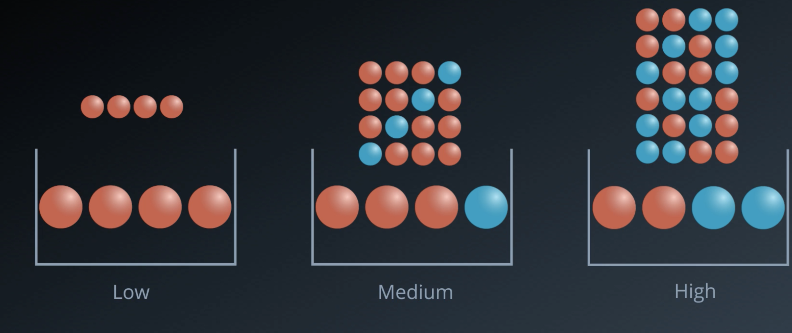
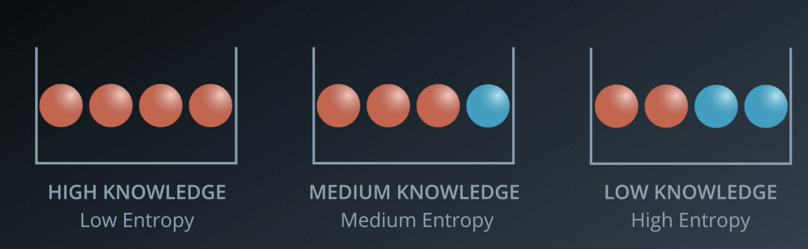
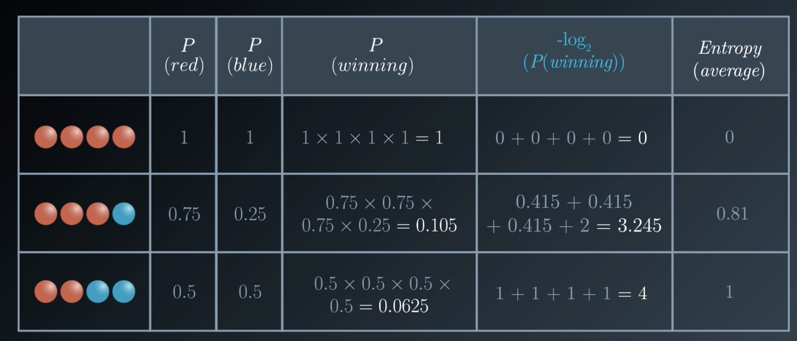
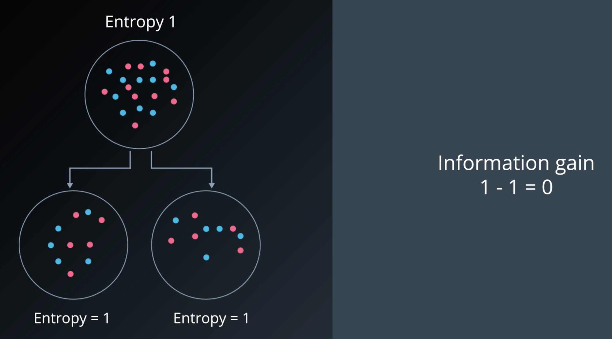

# Decision Trees

# Entropy
**Intuition:** 

- The more rigid/homogeneous the set is, the less entropy it will have.
- Knowledge and Entropy are "opposites". The more knowledge one has, the less entropy it has.

**How to calculate the Entropy?**

$H(x) = E[I(x)] = E[-ln(P(x))]$

$H(x) = - \sum_{i=1}^{n}P(x_{i}) \cdot log_{b}P(x_{i})$

**Note:** The Logarithm gets applied due to mathematical convenience since it's easier to work with sums.

## Information Gain

The Information Gain measures the change in Entropy. It can be calculated as follows:

$\text{Information Gain} = \text{Entropy(parent)} - 0.5 \cdot [\text{Entropy(Child 1}) + \text{Entropy(Child 2})]$

## Problems with Decision Trees

Decision Trees tend to overfit a lot. Decision Trees often have many nodes which end up giving us complex boundaries for our data.

One way to prevent that are so called **Random Forests**.
Therefore, we repeatedly pick some of the columns randomly and build multiple decision trees. Afterwards, we let all decision tree vote and pick the result that appears most often.

## Hyperparameters

- **Maximum Depth**  
The maximum depth of a decision tree is simply the largest length between the root to a leaf. A tree of maximum length k can have at most $2^k$ leaves.

- **Minimum number of samples per leaf**  
When splitting a node, one could run into the problem of having 99 samples in one of them, and 1 on the other. This will not take us too far in our process, and would be a waste of resources and time. If we want to avoid this, we can set a minimum for the number of samples we allow on each leaf.

- **Minimum number of samples per split**  
This is the same as the minimum number of samples per leaf, but applied on any split of a node.

- **Maximum number of features**  
Oftentimes, we will have too many features to build a tree. If this is the case, in every split, we have to check the entire dataset on each of the features. This can be very expensive. A solution for this is to limit the number of features that one looks for in each split. If this number is large enough, we're very likely to find a good feature among the ones we look for (although maybe not the perfect one). However, if it's not as large as the number of features, it will speed up our calculations significantly.
