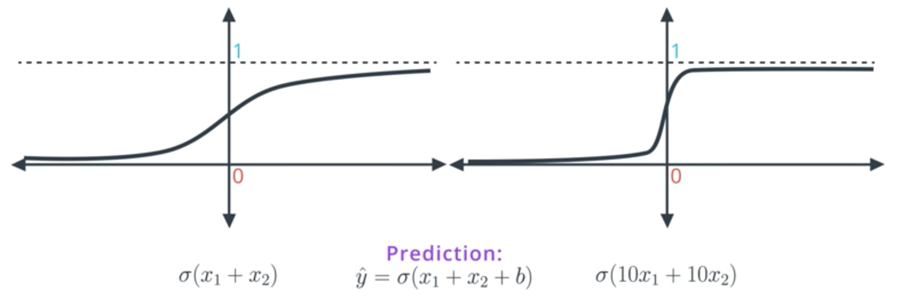
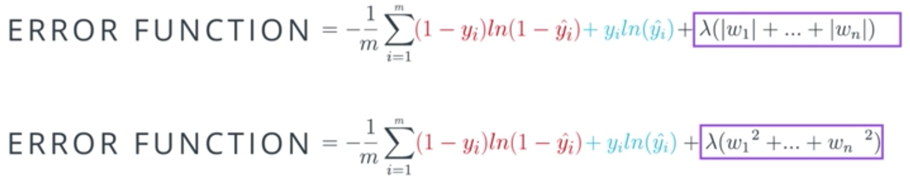
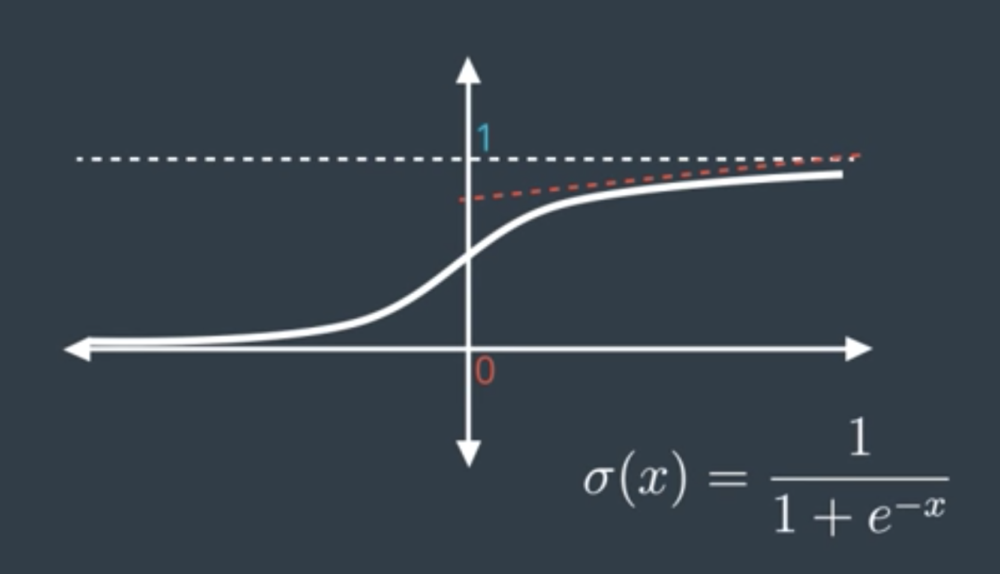
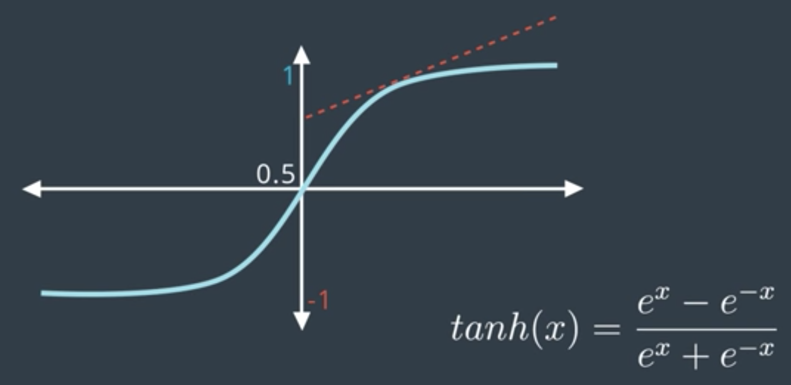

# Deep Neural Networks

## Regularization

Let's consider the following two functions:

You might wonder which functions is a better predictor for your problem.  
For example: Let's assume we want to classify the points (-1,-1) and (1,1). If we calculate the prediction, we will see that the prediction of the second function is almost close to 1/-1. Therefore, it seems that #2 is the better predictor. However, this is not true since the slope of the second function is much steeper and that's why it becomes much harder to do gradient descent (the derivates are mostly close to 0).  
Therefore, in order to do gradient descent properly, we prefer the model on the left. The model on the right is too certain!

How can we avoid such functions?  
We want to punish large coefficients. Therefore, we add an additional term to our error function that penalizes large weights.

## Dropout

When we train our network it might happen that some parts of a network tend to develop much larger weights than other parts. So the part with large weights starts to dominate our training while the other part gets "ignored".  
A common way to prevent this is called "dropout". By randomly removing some weights (connections) in each epoch we make sure that all parts of the network get trained.

## Vanishing Gradients and other activation functions

The sigmoid function often has the problem of "vanishing gradients". For instance, if we calculate the gradient on the right, we will see that the slope is quite flat and therefore the gradient is almost 0. This becomes even worse in Multi-Layer-NN since we multiple the products of gradients when performing backpropagation. So we end up making even tinier steps.

**Alternative activation functions:**  

- Hyperbolic tangent  
  
- RELU

## Momentum

The idea of momentum is to overcome the local minimum problem by "momentum" and "determination". Therefore, we take the weighted average of the last X gradients which allows us to get over "humps".

## Keras Optimizers

- SGD  
  This is Stochastic Gradient Descent. It uses the following parameters:
  
  - Learning rate
  - Momentum  
    This takes the weighted average of the previous steps, in order to get a bit of momentum and go over bumps, as a way to not get stuck in local minima).
  - Nesterov Momentum (This slows down the gradient when it's close to the solution).

- Adam  
  Adam (Adaptive Moment Estimation) uses a more complicated exponential decay that consists of not just considering the average (first moment), but also the variance (second moment) of the previous steps.

- RMSProp  
  RMSProp (RMS stands for Root Mean Squared Error) decreases the learning rate by dividing it by an exponentially decaying average of squared gradients.
