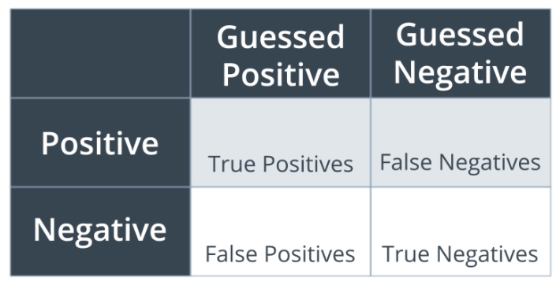

# Evaluation Metrics
## Confusion Matrix
A confusion matrix is a table that is often used to describe the performance of a classification model.

The confusion matrix for a binary classifier looks as follows:

 
**Note:**  
_False Positive_ is also known as _Type 1 Error (Error of the first kind)_. 
_False Negative_ is also know as _Type 2 Error (Error of the second kind)_.

## Accuracy
The accuracy of a model tells of how many points get classified correctly.

\\(\text{Accuracy} = \frac{\text{Correctly classified points}}{\text{All points}}\\)

However, the accuracy isn't always a suitable metric to say whether a model performs well or not. 
This is typically the case when data are imbalanced. For example, let's assume we want to predict whether an e-mail is spam or not. Such a dataset will often comprise of many non-fake e-mails and a few fake e-mails. A highly imbalanced dataset. 
What would be a potential model that achieves a good accuracy? Well, let's assume we have a model that classifies every e-mail as non-spam. Since the minority of the e-mails is non-spam your classifier will achieve a very good accuracy. Nonetheless, despite of a good accuracy our model is insufficient since it's not able to classify any e-mail as spam.  
Therefore, evaluating the accuracy of this model is pointless.

## Precision
## Recall
