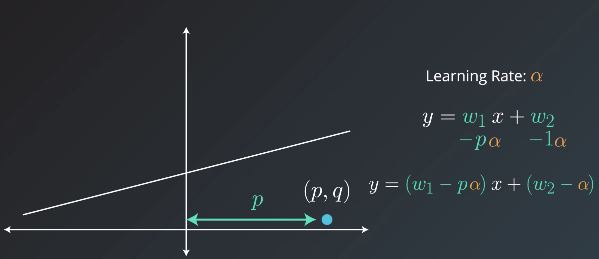
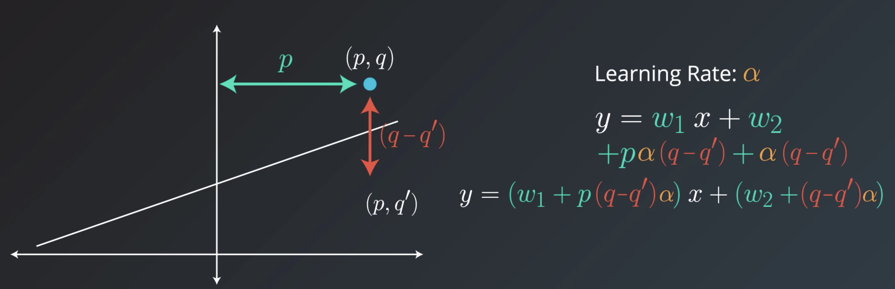
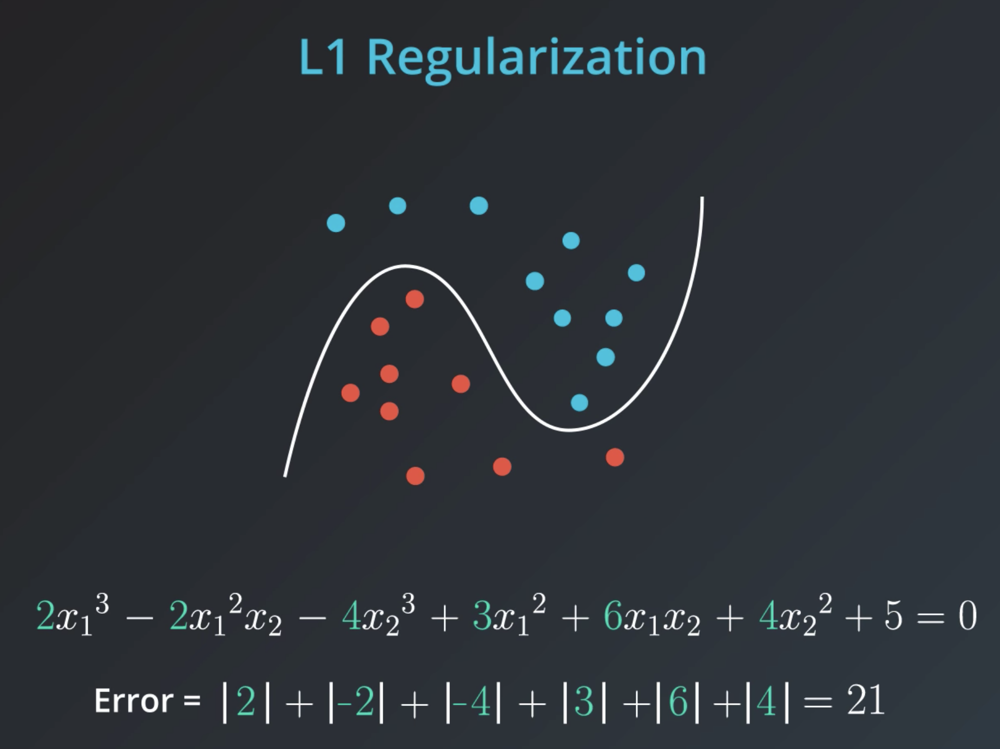
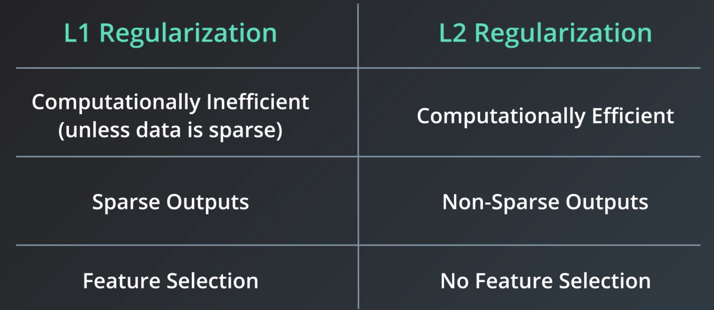

# Linear Regression

## Absolute Trick

If the point is above the line:  
$y = (w_{1}+\alpha \cdot p) \cdot x + (d+\alpha)$

If the point is bellow the line:  
$y = (w_{1}-\alpha \cdot p) \cdot x + (d-\alpha)$

**Why do we need the p?**

* If p is on the left of the y-axis, it's a negative number. Therefore we rotate the line in the correct direction.
* If the distance to the y-axis is small, we want to add a small number. Otherwise, we are going to add a large number.

## Squared Trick
Idea: If the point is close to the line, we want to move the line more than when it's close.

$(y = (w_{1}+p(q-q')\alpha) \cdot x + (d+(q-q')\alpha)$

## Linear Regression Warnings

**Linear Regression Works Best When the Data is Linear**

Linear regression produces a straight line model from the training data. If the relationship in the training data is not really linear, you'll need to either make adjustments (transform your training data), add features or use another kind of model.

**Linear Regression is Sensitive to Outliers**

Linear regression tries to find a 'best fit' line among the training data. If your dataset has some outlying extreme values that don't fit a general pattern, they can have a surprisingly large effect.

## Regularization
A useful technique to improve our models and make sure that they don't overfit.

Let's assume that we have two models. One is simple (eg. linear equation) and one that is more complex (higher-degree polynomial). Of course, the polynomial is more likely to do better on the training set since it's easier to get a low error.

However, still less complex models tend to generalize better. Regularization is a way to take the complexity of a model into account when computing the error.

**L1-Regularization**

We take all coefficients, sum up their absolute values and add them to the error.

**L2-Regularization**

Same idea, but instead of adding values we add the squares of the coefficients.

**Question: How much do we want to punish our model?**

This question that is strongly problem-dependent. Some problems (e.g building a rocket) might require more complexity, while others, e.g. a video recommender leaves more room for complexity.

Therefore, it's common to introduce a parameter $\lambda$ that allows us to influence the "strength" of punishment by multiplication with the computed regularization factor.

**L1- vs. L2- Regularization**

