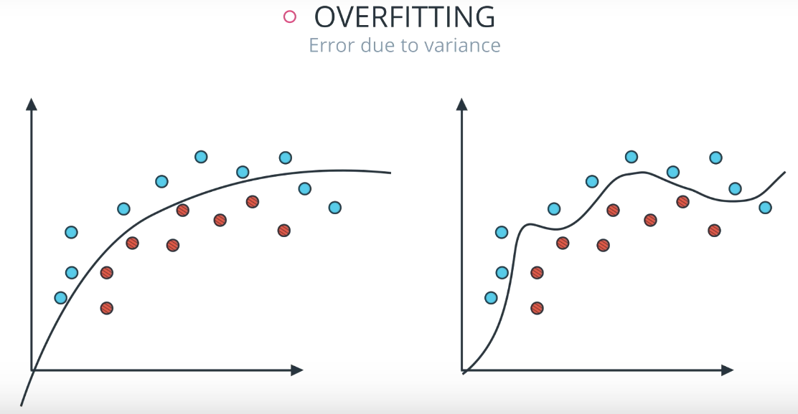
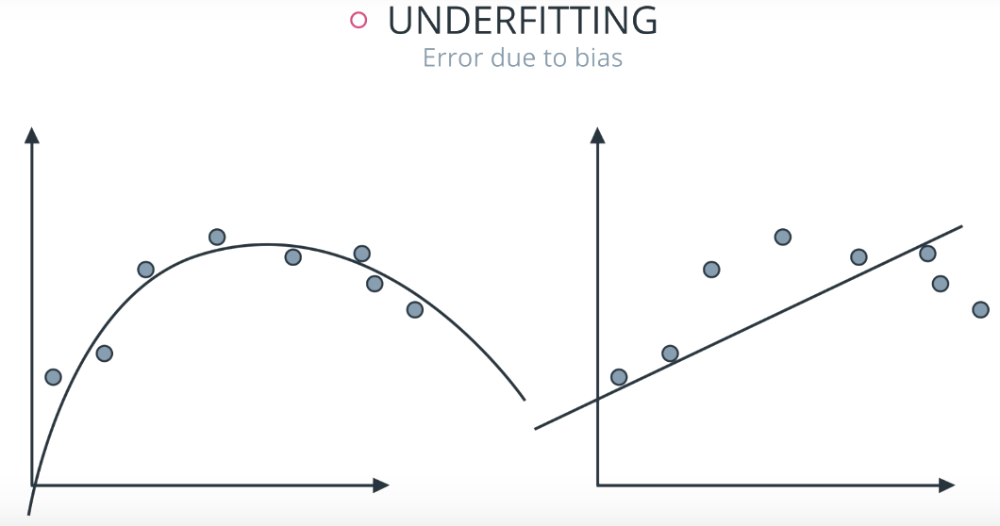
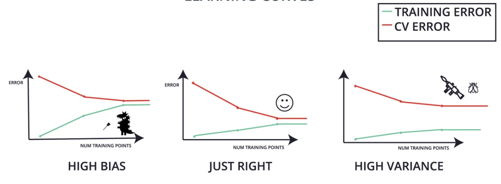
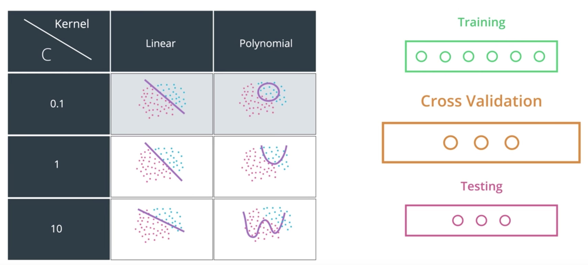

# Model Selection
## Types of Errors
**Overfitting:** Overcomplicate the problem. The model does well in the training set,
but tends to memorize it instead of learning the characteristics of it. Error due to variance.

**Underfitting:** Oversimplify the problem. Does not do well in the training set. Error due to
bias.

## Cross Validation
**Golden Rule:  Never use testing data for training**

A solution to this problem is splitting the data into a training set, cross validation set and testing set.

**Training set:** Used for training the parameters
**Validation set:** Used for making decisions about the model (e.g. degree of the polynomial)
**Testing set:** Measure the performance of the model

**Example:**
Train models of different degrees (1,2,3,4). Then we use the cross validation set to calculate the score (e.g. F1-Score) for each model. Finally, we pick the model with the highest score and use the test set to compute the accuracy.

## k-Fold Cross Validation
The Cross Validation approach has a significant drawback. Since we spit our data, we always throw away some data. k-Fold Cross Validation is a useful method to recycle our data.

We break our data into k buckets. Every time we use one bucket for testing and k-1 buckets for training. Finally, we average the result.

## Learning Curves
The following graph shows how we can differentiate between overfitting, underfitting and a "good" model.

## Grid Search
Grid Search is a simple way to find the best parameter for different models. Literally, what it does is it makes a table with all possibilities and picks the best one.

