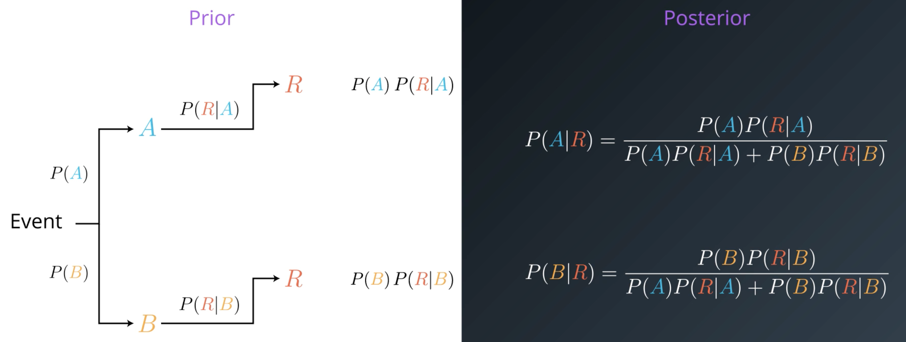

# Naive Bayes

## Bayes Theorem

Incorporates knowledge of an event. It switches from what we know to what we infer.

Let's say we know the probability of an event P(A) and the probability of an event P(R|A). P(R|A) is related to A.  
Bayes Theorem infers the probability of A given R. This is the new probability of A once we know that the event R has occurred.

**Prior Probability**  
The probability of an event without additional knowledge.  
"What we knew before we knew that R occurred."

**Posterior Probability**  
The probability of an event after inferring the additional knowledge.  
"What we inferred after we knew that R occurred."

## False Positives
Let's consider the following scenario:

_Suppose that you are worried that you might have a rare disease. You decide to get tested, and suppose that the testing methods for this disease are correct 99 percent of the time (in other words, if you have the disease, it shows that you do with 99 percent probability, and if you don't have the disease, it shows that you do not with 99 percent probability). Suppose this disease is actually quite rare, occurring randomly in the general population in only one of every 10,000 people._

_If your test results come back positive, what are your chances that you actually have the disease?_

**Answer:** Less than 1%!

The basic reason we get such a surprising result is that the disease is so rare that the number of false positives greatly outnumbers the people who truly have the disease. This can be seen by thinking about what we can expect in 1 million cases. In those million, about 100 will have the disease, and about 99 of those cases will be correctly diagnosed as having it. Otherwise, about 999,900 of the million will not have the disease, but of those cases about 9999 of those will be false positives. So, if you test positive, then the likelihood that you actually have the disease is about 99/(99+9999), which gives the same fraction as above, approximately .0098 or less than 1 percent.

## Naive Bayes

We've already discussed the idea of the Bayes Theorem that allows us to compute the probability of an event after inferring additional preknowledge.

We also learn that the conditional probability can be computed as follows:

$P(B | A) = \frac{P(A \cap B)}{P(A)}$

It's important to point out that event A and B don't need to be independent of each other when using this formula.

If we know, that A and B are independent of each other, we can simply say that P(A) = P(B). Therefore, it's also easy to say that it's easier to work with independent events than with depend events.

Unfortunately, in the real world, independent events are unlikely to occur and we also don't know how they are related to each other. Of course, this makes our life much harder. 

This is where Naive Bayes into play. In Naive Bayes classification, we simply assume that the occurrence of a particular event in a class is unrelated to each other even if this is not really the case in real-world. Luckily, this "naive" assumption often turns out to work pretty well.

$P(y | x_{1},...,x_{n}) = \frac{P(y)P(x_{1},...,x_{n}|y)}{P(x_{1},...,x_{n})}$