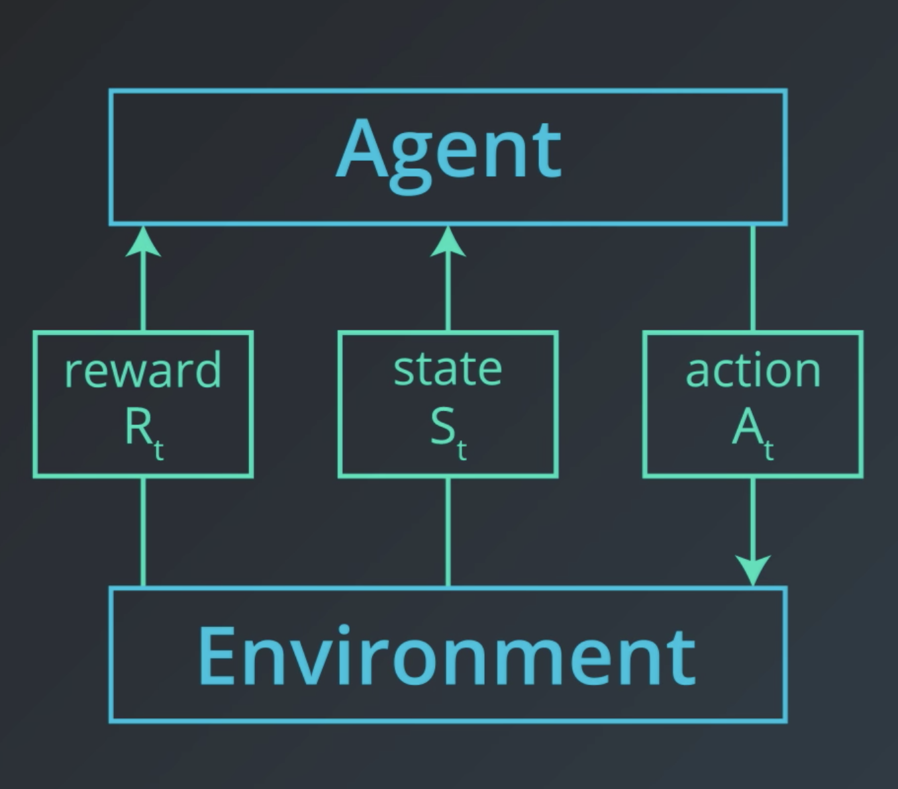
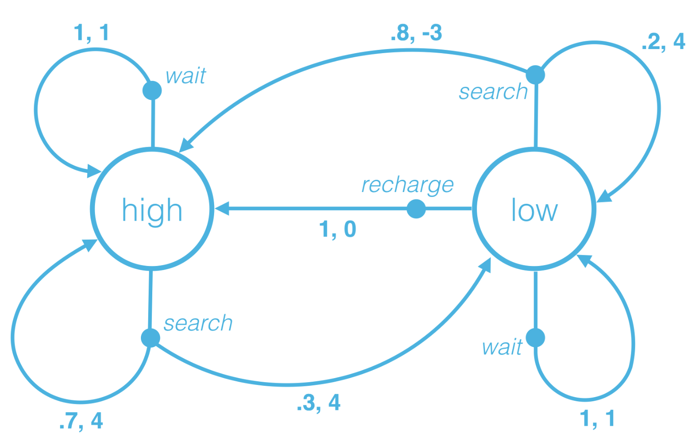
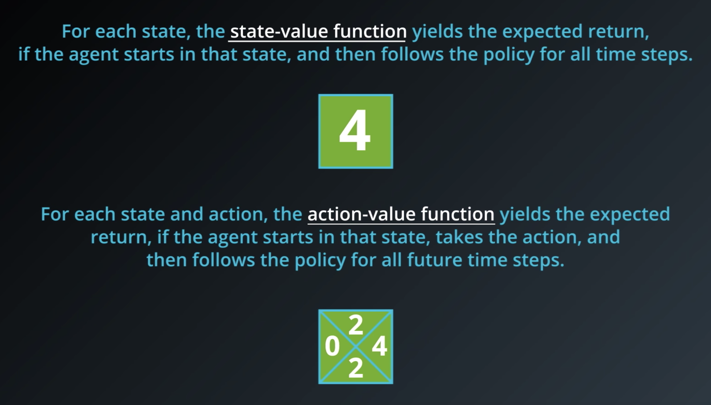
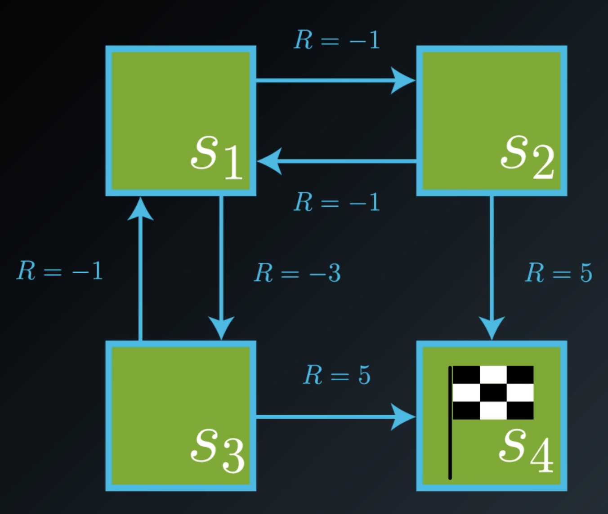

# Reinforcement Learning

## How does the reinforcement setting look like?

Reinforcement learning is all about learning from try and error. The learning framework can be described by an **agent** learning to interact with an **environment**. We assume that time involves in discrete time steps.
At the initial time step, the agent observes the environment. Then, it must select an appropriate action. In the next step (in response to the agent's action) the environment presents a new situation to the agent. It also provides the agent with some kind of reward. In response, the agent must choose an action.

The goal is to take actions that **maximize** the **expected cumulative reward**.

## Episodic and Continuing Tasks

If a problem has a well-defined ending point we call it an **episodic tasks**. For example, a chess game has a finite number of moves. The sequence of interactions is typically called an **episode**. It's always able to start from scratch like it's being reborn in the environment, but with the added knowledge from the past life.

**Continuing tasks** are ones that never end. For example, an algorithm that buys stocks and response to the financial market. In this case, the agent lives forever and it has to choose actions while simultaneously interacting with the environment.

## Rewards hypothesis

The term "reinforcement" originally comes from behavioral science. It refers to a stimulus that is delivered immediately after a behavior to make the behavior more likely to occur in the future. 

**Reward hypothesis:**  
All goals can be framed as the maximization of **expected** cumulative reward.

Let's consider an example to understand what this means in practice. Let's say we want to teach a robot to walk.

**What are the actions?**  
They are forces that the robot applies to its joints ("Gelenke").

**What are the states?**  
- The current position and volocities of all joints  
- Measurements of the ground  
- Contact sensor data (Used to determine whether the robot is still walking or falling over)

**What are the rewards?**  
We design the reward as a feedback algorithm as a feedback mechanism that tells the agent the appropriate movement.

$r = min(v_x,v_{max}) - 0.005(v_y^2 + v_z^2) - 0.05 y^2 - 0.02 ||u||^2 + 0.02$

Let's take a closer look at the reward function to understand what the individual components are.

$min(v_x,v_{max})$ ... Reward proportional to the robot's forward velocity. If it moves faster, it gets more reward (up to a certain limit denoted by $v_{max}$)

$0.02 ||u||^2$ ... Penalized by the amount of torque applied to each joint

$0.005(v_y^2 + v_z^2)$ ... Since the agent is designed to move forward, we want to penalize vertical movements.

$0.05 y^2$ ... Tracks whether the body move away from the center of its track. We want to keep the humanoid as close to the center as possible.

$0.02$ ... At every time step the agent receives some positive award if the humanoid has not yet fallen. If the robot falls, the episode terminates meaning that the humanoid missed a opportunity to collect more award.

## Cumulative reward

The question we are going to answer in this section is whether it's enough to maximize the reward at each time step or if it's always necessary to look at the **cumulative sum**.

Let's try to understand this using the walking robot example. If the robot only looked at the reward at a single time step, he would simply try to move as fast as possible without falling immediately. That could work well in the short term. However, it's possible that that the agent learns a movement that makes him move quickly, but forces him to fall in a short time. Hence, the individual award might be high, but the cumulative award is still small meaning that the agent can't walk.  
Therefore, we always need to look at short term and long term consequences.

## Discounted reward

If we look at a time step $t$ we will notice that all the rewards in the past have already been decided. The sum of rewards is called **return**. Only future rewards are in the agents control.

Since the events in the future are the ones that the agent can still decide, we really care about maximising the **expected** return. In other words, we can say that:  
At time step $t$ the agent takes an action $A_t$ that maximizes the **expected** return $G_t$.

$G_t = R_{t+1} + R_{t+2} + R_{t+3} + ...$

In case of **discounted rewards** we want give a much greater weight to steps the occurred much earlier in time.

${G_t}_{discount} = R_{t+1} + 0.9 \cdot R_{t+2} + 0.81 \cdot R_{t+3} + ...$

We often write it like... 

${G_t}_{discount} = R_{t+1} + \gamma \cdot R_{t+2} + \gamma^2 \cdot R_{t+3} + \gamma^3 R_{t+4}...$ where $\gamma \in [0,1]$

$\lambda$ is called the **discount rate**

By choosing $\lambda$ appropriately, we can decide how far we the agent should look into the future.

**Note:** The larger $\gamma$ gets, the more we care about the future (try it by plugging in values for $\gamma$)

**But what is the initiation behind that?**  
It's because events that occur soon are probably more predictable.  
Let's illustrate it by means of an example. Let's imagine somebody tells you that he is going to give you a marshmallow right now. Furthermore, he also tells you that he will probably give you one tomorrow as well. Of course, you would immediately take the marshmallow you get today. So, whatever today's marshmallow is worth to you, tomorrow's marshmallow is probably only worth a percentage of that to you.

## Markov Decision Process

A (finite) Markov Decision Process is defined by:

- a (finite) set of states $S$
- a (finite) set of actions $A$
- a (finite) set of rewards $R$
- the one-step dynamics of the environment  
  $p(s',r|s,a) = \mathbb{P}(S_{t+1} = s', R_{t+1}=r|S_t=s,A_t=a)$ for all $s$,$s'$,$a$ and $r$
- a discount rate $\lambda \in [0,1]$

### How do we encode the solution to a problem?
So far, we've learned that a MDP comprises of states and actions. In every state we can take a certain action and this action will take us into another state. Formally, we can see this as a mapping $\pi: S \rightarrow A$. Such a mapping is also called a **policy**. So, a policy simple tells for every state which action we take next. 

To be precise we should differ between **stochastic policies** and **deterministic policies**. Stochastic policies allow to choose actions randomly.

**Deterministic policy:**  
$\pi: S \rightarrow A$

**Stochastic policy:**  
$\pi: S \times A \rightarrow [0,1]$

$\pi(a|s) = \mathbb{P}[A_t=a|S_t=s]$

## State-value function

The state-value function is defined as follows:

$v_{\pi} = \mathbb{E_{\pi}}[G_t|S_t=s]$

So, the state-value function provides us with the expected return given a policy $\pi$ for an agent starting in state $s$.

## Bellman equations

We saw that the value of any state in a MDP can be calculated as the sum of the immediate reward and the (discounted) value of the next state.

So, for a given policy $\pi$ the expected value of the return starting in state $s$ is simply: $v_{\pi} = \mathbb{E_{\pi}}[G_t|S_t=s] = R_{t+1} + R_{t+2} + ...$.

Furthermore, it's important to see that this is equivalent to: $v_{\pi} = \mathbb{E_{\pi}}[G_t|S_t=s] = R_{t+1} + R_{t+2} + ... = \mathbb{E_{\pi}}[R_{t+1} + \lambda v_{\pi}(S_{t+1})|S_t=s]$

An equation in this form (immediate reward + discounted value of the state the state that follows) is called a **Bellman equation**.

## Optimality

$\pi' \geq \pi$ if and only if $v_{\pi'}(s) \geq v_{\pi}(s)$ for all $s \in S$

An **optimal policy** $\pi_*$ satisfies $\pi_* \geq \pi$ for all $\pi$.

## Action-value function

The action-value function is similar to the state-value function. However, the state-value function yields the expected return if the agent starts in state $s$, takes an action $a$ and then follows the policy for all future time steps.

The action-value function is typically denoted by $q$. It's also true that $v_{\pi}(s) = q_{\pi}(s,\pi(s))$ holds for all $s \in S$.

$q_{\pi}(s,a) = \mathbb{E}_{\pi}[G_t|S_t=s,A_t=a]$ 

All optimal policies have the same action-value function $q_*$ called the **optimal action-value function**.

## Dynamic Programming

**Dynamic programming** denotes a simplification of the reinforcement learning setting. We assume that the agent has full knowledge of environment (Markov decision process) that characterises the environment. Therefore, this is much easier than the reinforcement learning setting, where the agent initially knows nothing about how the environment decides state and reward and must learn entirely from interaction how to select actions.)

## Iterative method

Let's say we want to evaluate the state-value function of a *stochastic* policy of the following example:

As we know, stochastic policies deal with probabilities. Every action we take in a state has a certain probability. For simplicity, let's assume that every state has a probability of 50%.

$\pi(right|s_1) = 0.5$  
$\pi(down|s_1) = 0.5$  
$\pi(left|s_2) = 0.5$  
$\pi(down|s_2) = 0.5$  
$\pi(up|s_3) = 0.5$  
$\pi(right|s_3) = 0.5$

Hence, we can calculate the expected return using the state-value function:

$v_{\pi}(s_1) = 0.5 \cdot (-1 + v_{\pi}(s_2)) + 0.5 \cdot (-3 + v_{\pi}(s_3))$  
$v_{\pi}(s_2) = 0.5 \cdot (-1 + v_{\pi}(s_1)) + 0.5 \cdot (5 + v_{\pi}(s_4))$  
$v_{\pi}(s_3) = 0.5 \cdot (-1 + v_{\pi}(s_1)) + 0.5 \cdot (5 + v_{\pi}(s_4))$  
$v_{\pi}(s_4) = 0$

Finally, after solving the system of equations we get:

$v_{\pi}(s_1) = 0$  
$v_{\pi}(s_2) = 2$  
$v_{\pi}(s_3) = 2$  
$v_{\pi}(s_4) = 0$

**What's the problem with this approach?**  
Calculating the expected return for every state wasn't difficult in this example. However, if the state space grows, solving such a system of equations directly becomes increasingly difficult. We, therefore, prefer an iterative approach which we are going to discuss now.

**Solving the example by means of an iterative approach**  
We first start by setting the return of every state to 0.

Next, we take the state-value functions we had before and use them to guess the return of the corresponding state. We start with the state-function for state $s_1$

$V(s_1) = 0.5 \cdot (-1 + V(s_2)) + 0.5 \cdot (-3 + V(s_3))$  

After, plugging in our current estimates we get:

$V(s_1) = 0.5 \cdot (-1 + 0) + 0.5 \cdot (-3 + 0) = -2$  

We continue with state $s_2$:

$V(s_2) = 0.5 \cdot (-1 + V(s_1)) + 0.5 \cdot (5 + V(s_4))$  
$V(s_2) = 0.5 \cdot (-1 + -2) + 0.5 \cdot (5 + 0) = 1$ 

And, finally, we do the same for $s_3$:

$V(s_3) = 0.5 \cdot (-1 + V(s_1)) + 0.5 \cdot (5 + V(s_4))$  
$V(s_3) = 0.5 \cdot (-1 + -2) + 0.5 \cdot (5 + 0) = 1$ 

We keep updating the return for every state until there's no change. This is the key idea behind an algorithm called **Iterative policy evaluation**.

> **Iterative policy evaluation**
> 
> **Input:** MDP, policy $\pi$  
> **Output:** state-value function
> 
> V(s) = 0 for all $s \in S^+$
> 
> **repeat until $\delta < \theta$:**  
> $\hspace{0.5cm}$ $\Delta = 0$  
> 
> $\hspace{0.5cm}$ **for** $s \in S$:  
> $\hspace{1cm}$ $v = V(s)$  
> $\hspace{1cm}$ $V(s) = \sum_{a \in A(s)} \pi(a|s) \sum_{s' \in S, r \in R} p(s',r|s,a)(r + \lambda V(s'))$  
> $\hspace{1cm}$ $\Delta = max(\Delta, |v-V(s)|)$
> 
> return $V$

