# Unsupervised Learning

## Why do we need unsupervised learning?

Unsupervised learning becomes important once we have data that don't have a label.

The idea is to come up with algorithms that are able to detect structures in a dataset.  
For example, we might wanna try to find the clusters in the dataset.

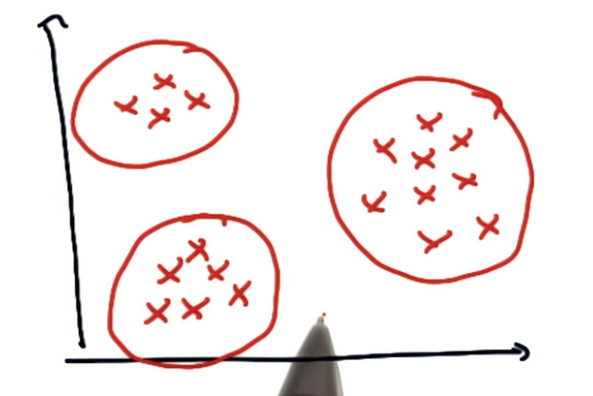

## K-Means Clustering

K-Means is an algorithm that allows us to detect clusters in dataset. A cluster can be seen as a group of points that have something in common. This typically means that the points are close to each other.

**Algorithm:**

1. Randomly pick n arbitary points as cluster centers.
2. Now let's compute the distance from every data point to each cluster center.  
3. Assign each point to the closest cluster center.
4. We now try to optimize the positions of the cluster centers. Therefore, we **minimize** to total of the **quadratic distances** between each point of a cluster center and the cluster center.
5. Move the cluster centers.

The cost function looks as follows:

$J = \sum_{i=1}^k \sum_{x_{j} \in S_{i}} || x_{j} - \mu_{i} ||^2$

**Note:** Solving the problem is not trivial (NP-hard!). Therefore, k-means algorithm only hopes to find the global minimum and possibly gets stuck at a local minimum.

**Visualization:** https://www.naftaliharris.com/blog/visualizing-k-means-clustering/

### Stability of k-means

**Will the output of K-Means always be the same?**

No, the result depends on the initial position of the cluster centers. Therefore, we can say that k-means **is not stable**.

Let's consider the following example:

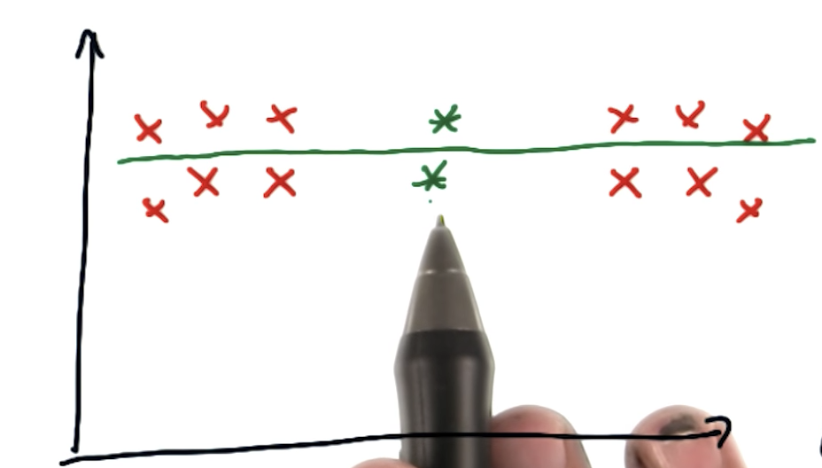

As we can see initializing k-means with the points shown in the image results in a very strange partitioning. Definitely, a partitioning we don't want.  
However, if we initialize the points differently, we might get another partitioning with cluster centers on the left/right.

There is no guarantee that k-means converges to the "right" solution.

### Downsides of k-means

K-Means does only work well if we know the number of cluster centers and if the data can be described by clusters that are **circular** or spherical or hyper-spherical in higher dimensions.

Let's take a look at the following examples to understand where k-means clustering fails.

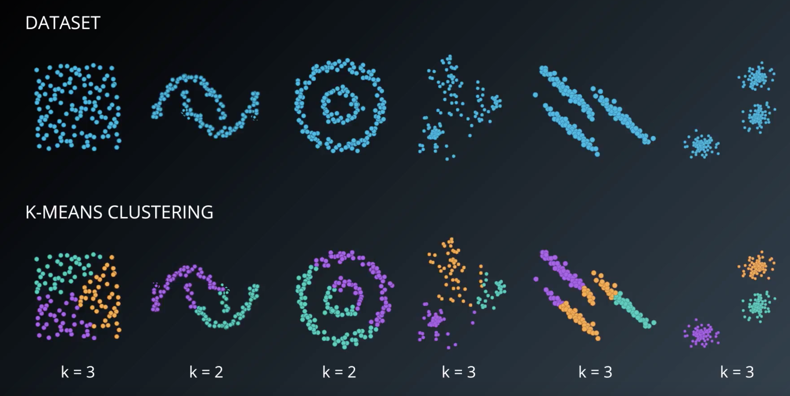

## Hierarchical clustering

As the name already implies "hierarchical clustering" is a method of cluster analysis which seeks to build a hierarchy of clusters.  
One specific form of hierarchical clustering is **single-link clustering**.

### Single-link clustering

**Algorithm:**

1. Compute the distance between each and every point in the dataset.
2. Select the two points which are closest to each other.
3. Group the two points into a cluster
4. Also we note down that we've just added the points to a cluster in a hierarchical tree.  
   
5. Proceed with step 1-4.

**Important:** If we want to compute the distance between a point to a cluster, we basically compute the distance between the point and the point from the cluster that is closest. 

**Note:** Hierarchical clustering algorithms typical differ in the way how distances between points-clusters, respectively, clusters-clusters get computed.

The final hierarchical cluster tree is also called **dendrogram**.

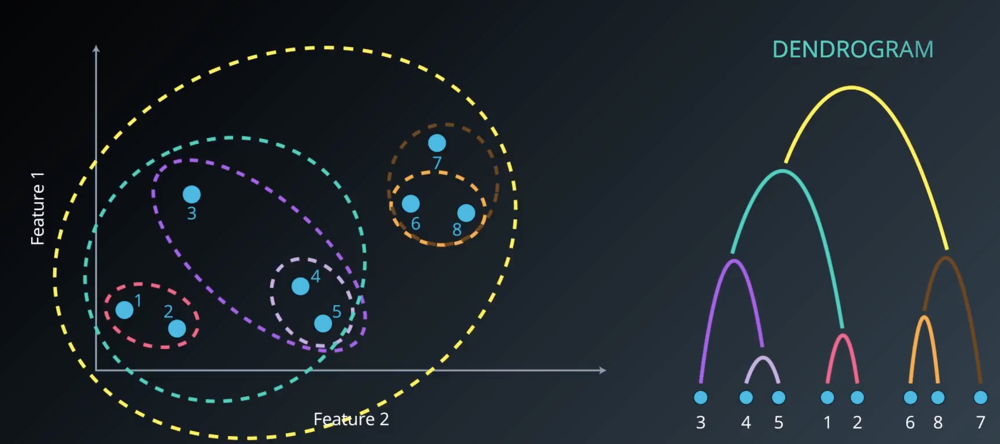

When we run the algorithm we need to tell the algorithm how many clusters we are looking for.  
Based on the number of clusters we can limit the height of the dendrogram.

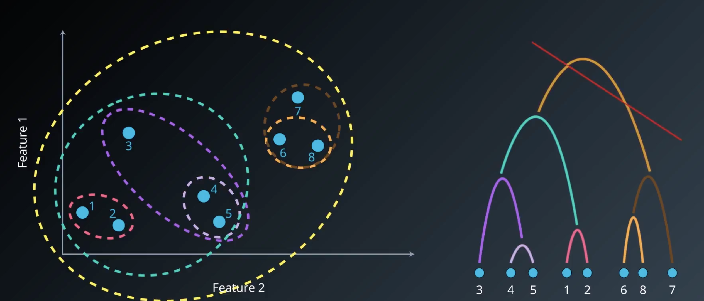

### Comparison K-Means / Single-link clustering

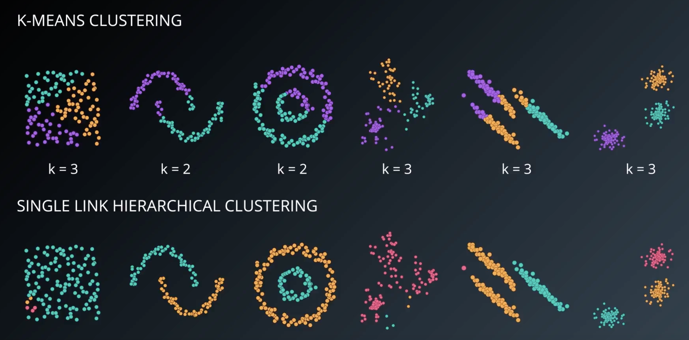

 
### Complete-Link clustering

Complete-link clustering basically works in the same way as single-link clustering.  
The only difference is the way how we compute distances between clusters.

In complete-linkage clustering, the link between two clusters contains all element pairs, and the distance between clusters equals the distance between those two elements (one in each cluster) that are farthest away from each other. The shortest of these links that remains at any step causes the fusion of the two clusters whose elements are involved. The method is also known as farthest neighbour clustering.

### Shortcomings of single and complete link clustering

- **Single linkage:** Often suffers from chaining, that is because, we only need a single pair of points to be close to merge two clusters. Therefore, clusters can be too spread out and not compact
enough.
- **Complete linkage:** Often suffers from crowding, that is because, a point can be closer to points in other clusters than to points in its own cluster. Therefore, the clusters are compact, but not far enough apart.

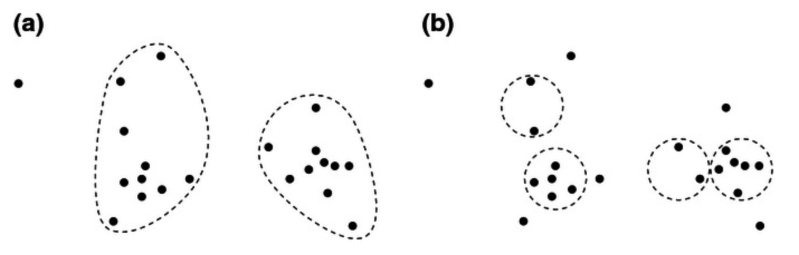

### Average Link Clustering

We simply compute the average distance between all points of the cluster to all other points of another cluster.

### Ward's Method

Tries to minimize the variance when merging two clusters. Ward's method tries to find a central point between two clusters. This can be done simply by averaging all the points.  
We can then compute the sum of the squared distances between all points of two clusters to the central point. From this sum we then substract the existing variance of both clusters.

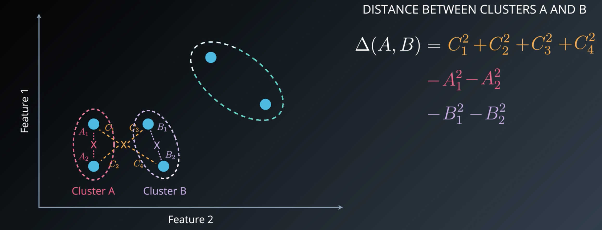

### DB-Scan

DB-Scan stands for **density-based spatial clustering of applications with noise**.

In DB-Scan not every point needs to be part of a cluster. Points that are not part of a cluster are considered as noise.

**Algorithm:**

1. Select an arbitary point in our dataset
2. Let's take a look at the surrounding neighbourhood of the point. Circular region with distance $\epsilon$ away from the point.
   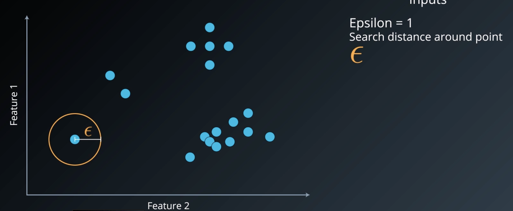
3. If there are less than $n_{min}$ data points in the circular region, we mark the point as noise.  
   If there are more than $n_{min}$ data points in the circular region (incl. points which are already marked as noise), we have found a cluster.  
   **Note:** The point we've selected is called **core "point**. The other points are called **border points**.
4. Dependent on whether we found a cluster or not we proceed as follows:  
   If we found a cluster, we proceed by performing the same check with the border points. If this point satisfies your cluster criterion, we merge the cluster with our previous cluster.  
   If not enough point were found, we proceed with step 1.  
   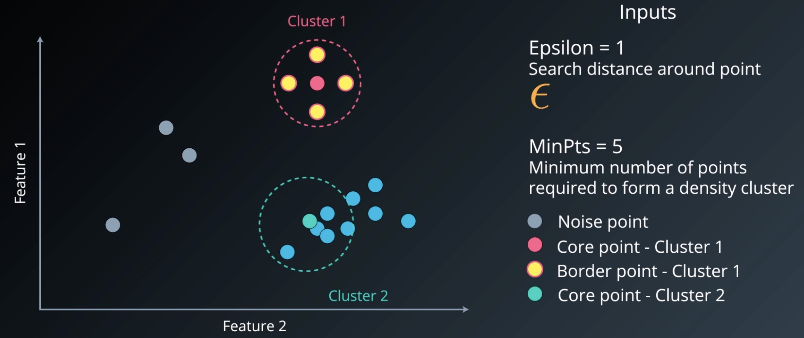
   

**Advantages:**

- We don't have to specify the number of clusters
- Flexibility in the shapes and sizes of clusters
- Able to deal with noise
- Able to deal with outliers

**Disadvantage:**

- Border points that are reachable from two clusters are assigned to the cluster that visits them first. So, DB-Scan is not guaranteed to return the same clustering all the time for this kind of data.
   
### Comparison K-Means / DB-Scan

## Gaussian Mixture Models

Gaussian Mixture Model clustering is a soft-clustering algorithm which means that every point belongs to **every** cluster we have with a certain probability.

It's a little bit like saying... Hmm, these set of points look like they come from a Gaussian distribution that looks like this. This distribution forms our cluster.

Formally, we try to approximate your distribution by a set of Gaussian distributions.

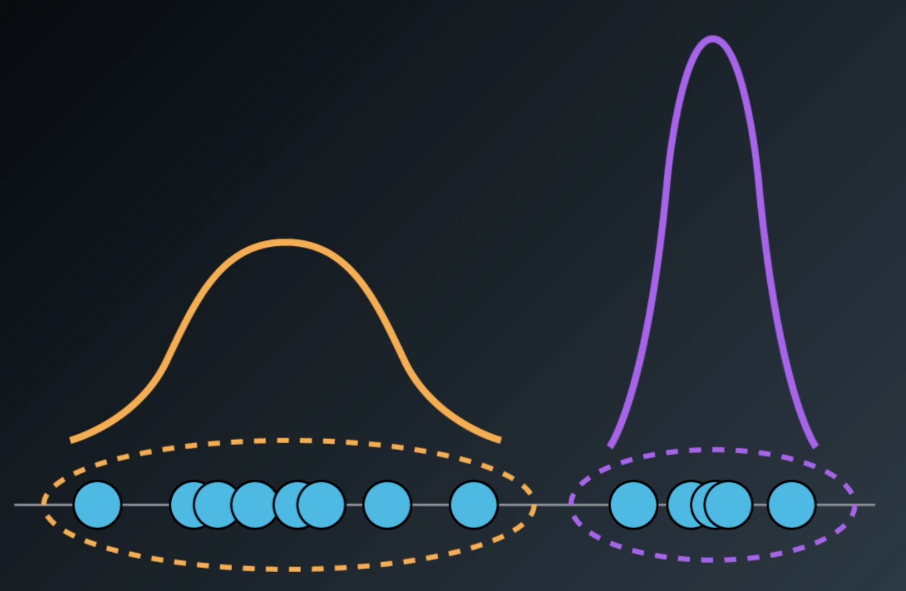

### Property of a Gaussian

One important property of a Gaussian distribution is the fact that the area between $\mu - 1\sigma$ and $\mu + 1\sigma$ contains 68% of all data points.  
The area between $\mu - 2\sigma$ and $\mu + 2\sigma$ contains 95% of the points.  
The area between $\mu - 3\sigma$ and $\mu + 3\sigma$ contains 99% of the points.

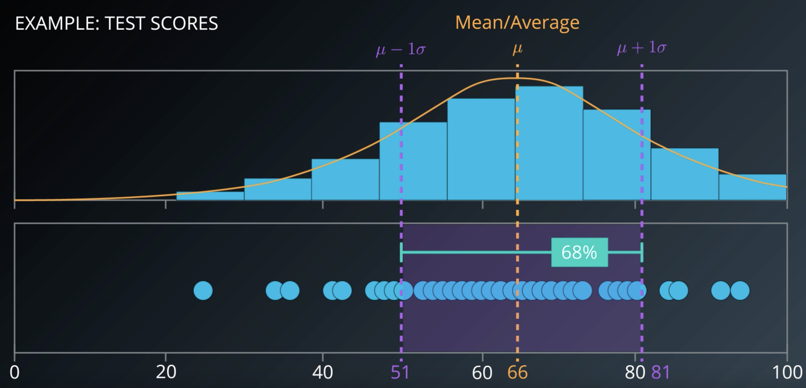

### EM (Expectation Maximization) - Algorithm

**Algorithm:**

1. Initialize Gaussian distributions

    